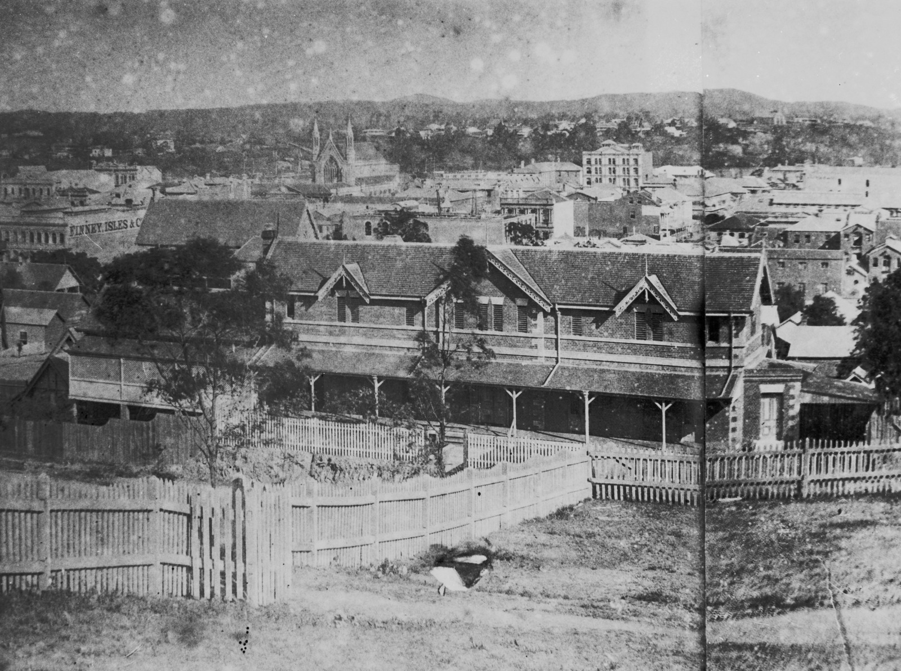

## Ann Drew <small>[(5‑43‑22)](https://brisbane.discovereverafter.com/profile/31986298 "Go to Memorial Information" )</small>

Ann was born in 1822 at Ashton, in Devon England, daughter of John Cornish, a yeoman farmer and his wife Sarah Smalridge. On 21 December 1848 Ann married Richard Langler Drew at St James Church, Exeter.

Ann and Richard migrated to Victoria in about 1858 and three years later they moved to Queensland where Richard was appointed shipping master and secretary to the Marine Board. Over the next four decades, particularly after her husband’s death in 1869, Ann was deeply involved in the administration of a number of welfare institutions, including the Lady Bowen Hospital, [Female Refuge and Infants' Home](https://www.findandconnect.gov.au/ref/qld/biogs/QE00329b.htm), Lady Musgrave Lodge and the Social Purity Society. Ann also took part in agitation to repeal the Queensland Contagious Diseases Act of 1868. Ann died at Sandgate, near Brisbane, on 5 August 1907.

<figure markdown>
  { width="70%" class="full-width" }
  <figcaption markdown>[Female Refuge & Infants' Home, Brisbane, ca. 1885](https://onesearch.slq.qld.gov.au/permalink/61SLQ_INST/dls06p/alma99183513293302061). — State Library of Queensland.</figcaption>
</figure>
