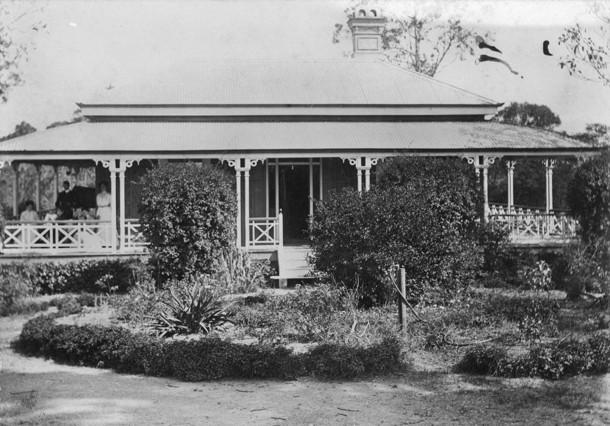

## Anne Devoy <small>(7‑7‑34)</small>

<!-- https://trove.nla.gov.au/newspaper/article/19550487?searchTerm=anne%20Devoy -->

Born 1817 at Donadea near Hodgetown Co. Kildare, Devoy was the daughter of James and Honor Reilly. Her mother was the daughter of the Countess de Farnton, who escaped the guillotine in the French Revolution, and fled to Ireland to take up refuge with her friend, the Earl of Kildare at Castle Kilkea. 

Anne married Patrick Devoy and with the union came the “*curse of the Devoys*”. This had been placed on a Devoy of Huguenot stock who turned in a Catholic priest to Cromwell’s men. As he was taken away, the priest blessed all the Devoy women and cursed the men so that no male Devoy would live to see his son in manhood. 

The Devoys arrived in Queensland in 1864 on the *Landsborough* after selling their land in Ireland to the Ursuline nuns. They brought a young family with them; John (later Managing Director of Castlemaine Perkins), Marguerite and Annie. In the tradition of the curse [Pat was killed the same year by a landslide](https://trove.nla.gov.au/newspaper/article/123149288?searchTerm=Patrick%20Devoy) while selecting land near Toowoomba. Anne died in 1908.

{ width="70%" }  

*<small>[Devoy residence in Ashgrove, Brisbane, ca. 1908](http://onesearch.slq.qld.gov.au/permalink/f/1upgmng/slq_alma21218171470002061). The Devoy residence was in Three Mile Scrub Road (now Ashgrove Avenue), off Waterworks Road. John Devoy was the manager of Castlemaine Perkins. — State Library of Queensland.</small>*
