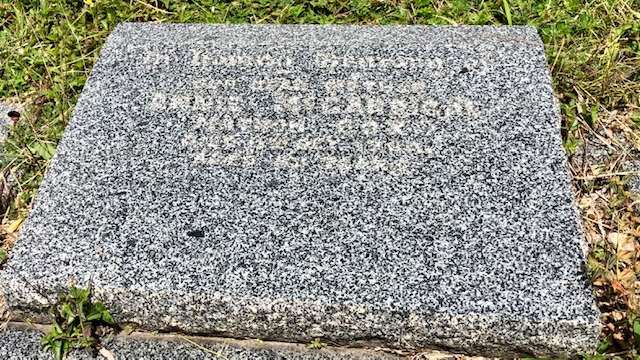

## Annie McGarrigal <small>(22‑22‑23)</small>

Annie McGarrigal was better known as Matron Cox. She trained at the Brisbane Children’s Hospital in 1922 and was on the ANTA Register in 1923. Annie died on 11 October 1964 aged 82.

{ width="70%" }  
