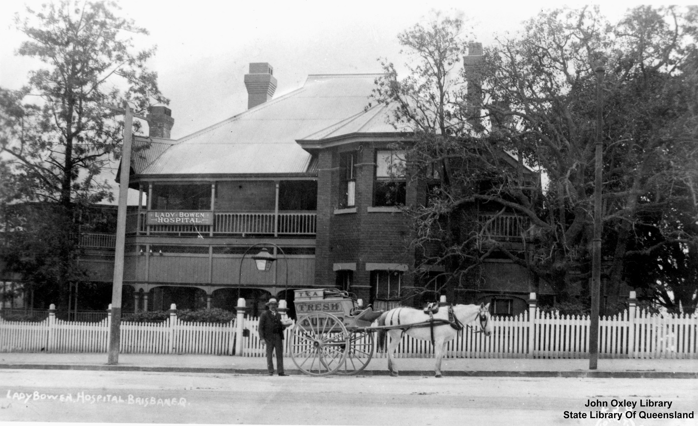

## Annie Perry <small>(13‑70‑5)</small>

Annie Perry was the daughter of William Harcourt, a brass founder and his wife, Elizabeth Mills. She was born on 5 September 1834 in Edgbaston, a suburb of Birmingham in England. Annie arrived in Sydney with her parents and sister on the ship *La Hogue* on 26 October 1860. On 27 February 1862 she was married in St Philips’ Church in Sydney by the Anglican Dean of Sydney to William Perry, one of Brisbane’s early businessmen and later a member of the Qld Legislative Council.

At the time of her death, Annie was one of the longest serving members of the committees of the Children’s and Lady Bowen Hospitals. She also took a great interest in the Creche and Kindergarten Association after its formation in 1907, the Queensland Society for the Prevention of Cruelty and all movements that had as their aim the betterment of the conditions for women, children and animals. Annie
passed away at the age of 82 years on 12 May 1917.

<figure markdown>
  { width="70%" class="full-width" }
  <figcaption markdown>[Lady Bowen Lying-in Hospital on Wickham Terrace, Brisbane](https://onesearch.slq.qld.gov.au/permalink/61SLQ_INST/dls06p/alma99183512644802061), 1912 — State Library of Queensland.</figcaption>
</figure>