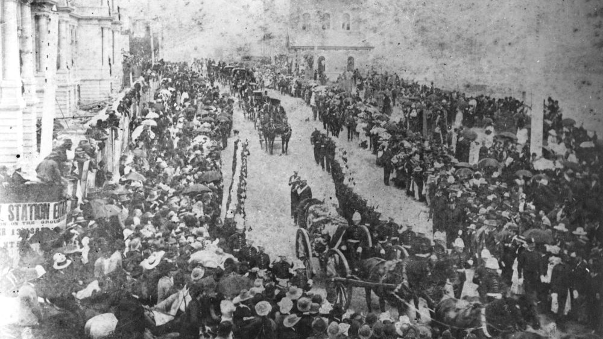

## Sir Anthony Musgrave G.C.M.G. <small>(14‑23‑7)</small>

Governor – 6 November 1883 to 9 October 1888

Musgrave was born on 17 November 1828 at Antigua, West Indies, son of Dr Anthony Musgrave and his wife Mary, née Sheriff. Educated in the West Indies, he became private secretary at 21 to the Governor of the Leeward Islands. In 1851 he was admitted to the Inner Temple, London, but returned to Antigua where he served as Colonial Secretary from 1854‑60. In 1853 he had married Christiana Elizabeth Byam who died in 1858. Musgrave was Administrator of Nevis from October 1860 to April 1861, then of St Vincent and in May 1862 became Lieutenant‑governor. In 1864‑69 he governed Newfoundland. At San Francisco en route to a new post in British Columbia he married Jeannie Lucinda Field by whom he had three sons. He was transferred to Natal in 1872.

On 6 March 1873 Musgrave became Governor of South Australia suffering a personal tragedy when his young daughter died of burns shortly afterwards. In 1877 he was appointed Governor of Jamaica. After six years, he became governor of Queensland on 21 July 1883. He visited England in 1886 and planned to retire but in June 1888 Sir Thomas McIlwraith, whom he detested, became premier. The two soon clashed over the governor's right to exercise of the prerogative of mercy. Musgrave appealed to the Colonial Office, McIlwraith defied him. A few weeks later Musgrave died on 9 October 1888.

*<small>[Funeral of Sir Anthony Musgrave, Brisbane, 1888](http://onesearch.slq.qld.gov.au/permalink/f/1upgmng/slq_alma21218493890002061) - State Library of Queensland. Cropped. </small>*
