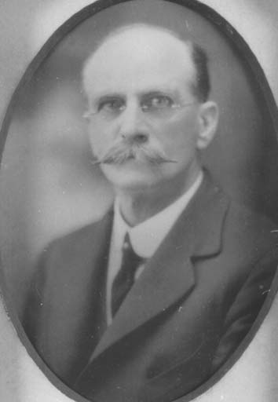
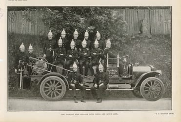

## Archibald Watson <small>(12‑13‑2)</small>

Archibald was the Chairman of the Toowong Fire Brigade, which had built a [fire station in Jephson Street](https://heritage.brisbane.qld.gov.au/heritage-places/1703) in 1919. He was the last Mayor of the town of Toowong in 1925 and went on to serve as an Alderman on the Brisbane City Council between 1926 and 1931. He was Deputy Mayor from 1926 to 1931 and Lord Mayor from February to May 1931. He died on 25 February 1941 aged 67.

{ width="29%" }  { width="62.1%" }  

*<small>[Alderman Archibald Watson](https://library-brisbane.ent.sirsidynix.net.au/client/en_AU/BrisbaneImages/search/results?qu=Alderman+Archibald+Watson&rm=BRISBANEIMAGES0%7C%7C%7C1%7C%7C%7C0%7C%7C%7Ctrue&te=ASSET&lm=ALL_ASSETS) — Brisbane City Council.</small>*  
*<small>[Page 27 of the Queenslander Pictorial, supplement to The Queenslander, 6 September, 1919.](http://onesearch.slq.qld.gov.au/permalink/f/1upgmng/slq_digitool1052814) The Toowong Fire Brigade with their new motor reel — State Library of Queensland. Cropped.</small>*  
