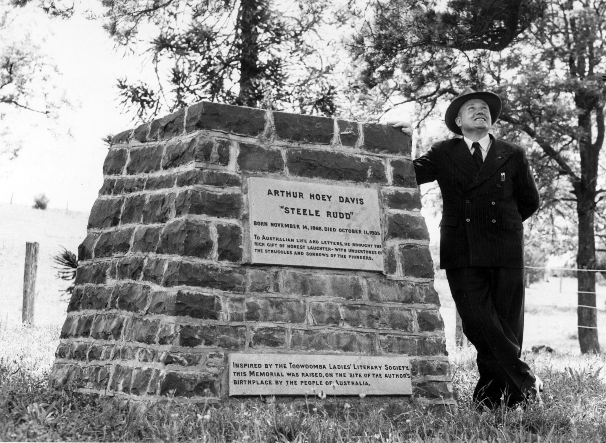

## Arthur Hoey Davis <small>(29A‑47‑4)</small>

Arthur Hoey Davis, born at Drayton near Toowoomba in 1868, was one of Queensland's literary greats and arguably the best remembered and best loved of the Queensland writers of yesteryear. He adopted the pseudonym 'Steele Rudd'. In 1895 *The Bulletin* published his ‘Starting the Selection’, a short story based on his father's experience, in which Rudd introduces the characters in his legendary family, and sets the pattern for further adventures. 

Davis became a regular and popular contributor and in 1899 the *Bulletin* published an illustrated collection of the sketches in book form under the title *On Our Selection*. He lay in an unmarked grave after his death in 1935 until an appeal for public subscriptions by the Queensland Authors and Artists' Association resulted in the erection of a headstone in 1956.

<figure markdown>
  { width="55%" class="full-width" }
  <figcaption markdown>[Steele Rudd Memorial, Drayton, c 1958](https://www.flickr.com/photos/queenslandstatearchives/41079431360/in/album-72157710041752261/) — Queensland State Archives.</figcaption>
</figure>

<!--
https://trove.nla.gov.au/newspaper/article/50031781
-->
