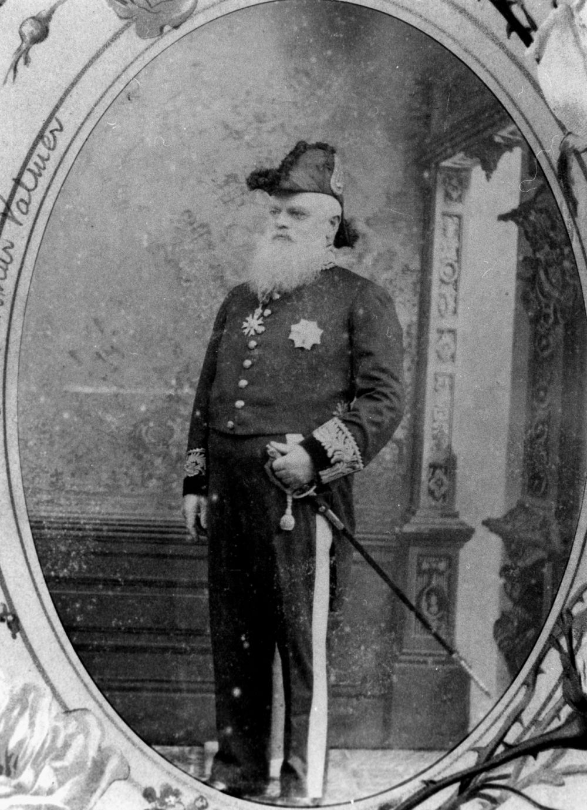

## Hon. Sir Arthur Hunter Palmer K.C.M.G. <small>(13‑88‑7)</small>

Administrator:

  - 2 May 1883 to 6 November 1883
  - 20 April 1886 to 13 December 1886
  - 9 October 1888 to 1 May 1889
  - 16 November 1890 to 6 May 1891 

Lieutenant Governor - 15 Nov. 1895 to 9 April 1896 

Palmer was born on 28 December 1819 in Armagh, Ireland, son of Arthur Palmer, naval lieutenant, and his wife Emily, née Hunter. Educated in Dublin, Palmer arrived in Sydney in 1838. In 1840 became manager pastoral holdings of Henry Dangar leaving after fifteen years to set up on his own. Once established, Palmer took an active part in local politics. He married, on 8 June 1865 in Sydney, Cecilia Mosman. 

In 1866 Palmer was elected for Port Curtis to the Legislative Assembly. After the Macalister government fell in 1867, Palmer became Colonial Secretary and Secretary for Public Works under Mackenzie. The ministry fell in November 1868 and Palmer joined the Opposition. When Lilley's ministry fell in May 1870 Governor Blackall appointed Palmer as Colonial Secretary and Premier, holding office until January 1874 when he became leader of the Opposition. In 1878 he retired as leader of the Opposition in favour of McIlwraith and was elected for North Brisbane. 

In January 1879 Palmer was appointed Colonial Secretary and president of the Executive Council. For a time in 1879‑80 Palmer acted as Premier while McIlwraith was in England. Palmer was appointed K.C.M.G. In December he resigned from the assembly and was called to the Legislative Council. From 2 May to 6 November 1883 and from 9 October 1888 to 1 May 1889 he acted as Administrator of the colony in the absence of the governor and from 15 November 1895 to 9 April 1896 was the first Lieutenant‑Governor of the colony. 

In 1885 his wife had died, leaving three sons and two of their four daughters. Palmer died on 20 March 1898 at his home at Toowong.

{ width="40%" }

*<small>[Sir Arthur Hunter Palmer as the Colonial Secretary](http://onesearch.slq.qld.gov.au/permalink/f/1upgmng/slq_alma21218625050002061) - State Library of Queensland </small>*
