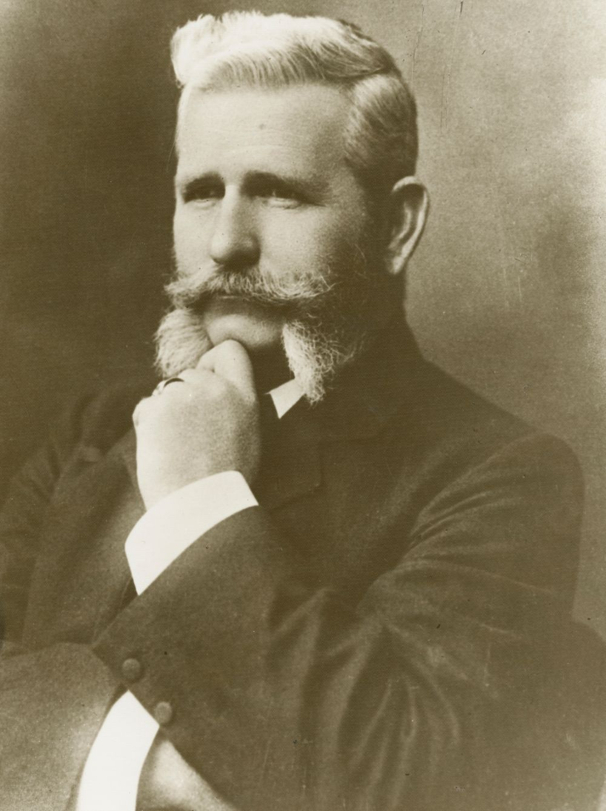
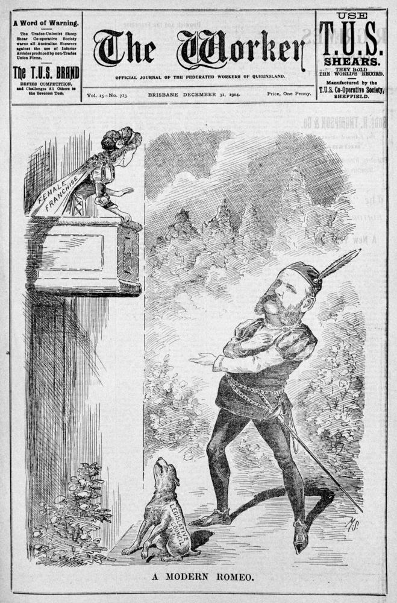

## Sir Arthur Morgan <small>(12‑15‑12)</small>

Sir Arthur Morgan was born on 19 September 1856 at Rosenthal station, Warwick, Queensland, son of James Morgan and his wife Kate (née Barton), both Irish born. Arthur Morgan entered politics in 1885 when elected to the Warwick Municipal Council, serving as mayor in 1886-90 and 1898. 

On July 1887 he was first elected to the Legislative Assembly for Warwick. He regained Warwick on 2 October 1898. In 1903 he became Premier under the Morgan-Browne coalition ministry. Morgan made good on a promise that he would introduce an electoral reform Bill to give women the vote and abolish plural voting. This was introduced to the Legislative Assembly in September 1904 but it was not until 25 January 1905 that the Election Act Amendment Act received Royal Assent. 

Morgan died at his residence at Upper Paddington, on 20 December 1916 after a long illness; he was buried in Toowong Cemetery following a state funeral and service at St John's Anglican Cathedral.

{ width="40.8%" }  { width="36%" }  

*<small>[Sir Arthur Morgan](http://onesearch.slq.qld.gov.au/permalink/f/1upgmng/slq_alma21219359220002061) 1903 — State Library of Queensland.</small>*  
*<small>[Modern Romeo : suffragette movement in Queensland](http://onesearch.slq.qld.gov.au/permalink/f/1upgmng/slq_digitool190519) On 5 January 1905, two years after the formation of the Queensland Women's Electoral League, the Electoral Franchise Bill was introduced into the Legislative Assembly to give the women of Queensland the right to vote. The Elections Acts Amendment Bill, provide the necessary machinery, was introduced at the same time. Despite some misgivings about abolishing the plural vote, and difficulty with postal voting, these issues were overcome and the legislation giving the women of Queensland the right to vote was finally passed. It was assented to by the Lieutenant‑Governor on 26 January 1905 — State Library of Queensland.</small>*
