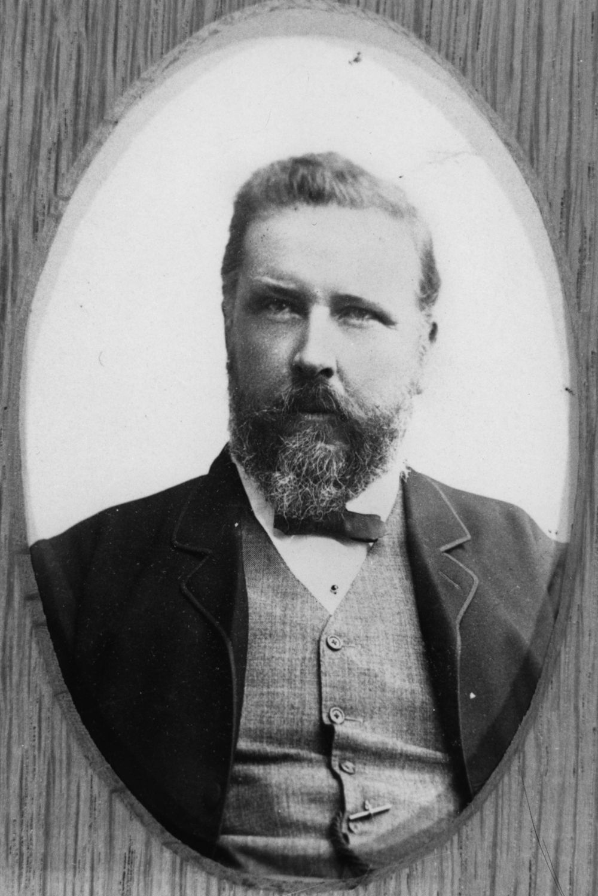

## Sir Arthur Rutledge KCMG, QC, MLA <small>(13‑49‑15)</small>

{ width="40%" } 

*<small>[Portrait of Sir Arthur Rutledge, 1883](http://onesearch.slq.qld.gov.au/permalink/f/1upgmng/slq_alma21218342430002061) - State Library of Queensland </small>* 

[Arthur Rutledge](https://adb.anu.edu.au/biography/rutledge-sir-arthur-8307) was born in New South Wales and came to Queensland as a Wesleyan Minister. From 1878 to 1893 and 1899 to 1904 he was a member of the Legislative Assembly. He served five years as Queensland’s Attorney General from 1883. Rutledge was admitted as a barrister in 1878 and became a QC in 1899 and later a district court judge. He was also the chairman of the Land Appeal Court. He was knighted in 1902. At the convention he was a member of the Judiciary Committee. He was a supporter of Griffith and the liberal franchise. Rutledge was also a strong supporter of the federation of the colonies and an opponent of the Northern Separatist movement.
