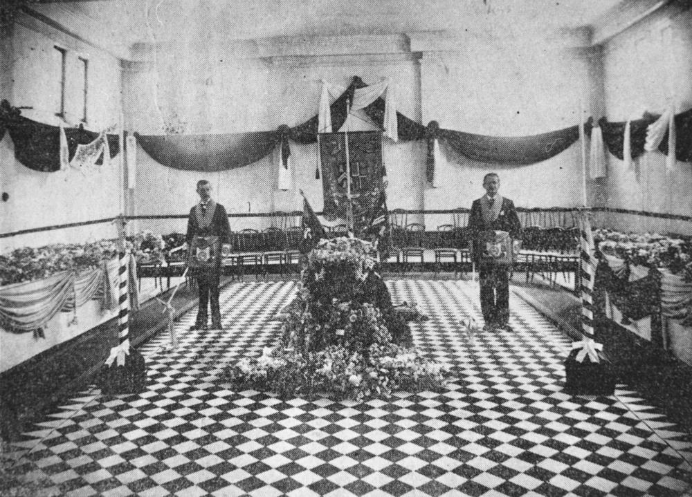

## Sir Augustus Charles Gregory <small>(14‑22‑14)</small>

The well‑known explorer [Gregory](https://adb.anu.edu.au/biography/gregory-sir-augustus-charles-3663) became the first President of the Toowong Shire Council in 1881. With his brother, Francis, Augustus was attached to the survey department of Western Australia and later joined the Survey Department in Queensland rising to the position of Surveyor General in 1859.

{ width="61%" }  { width="27.8%" }

*<small>[Sir Augustus Charles Gregory lying in state, Brisbane, 1905](http://onesearch.slq.qld.gov.au/permalink/f/1upgmng/slq_digitool73174) - State Library of Queensland </small>*  
*<small>[Sir Augustus Gregory](http://onesearch.slq.qld.gov.au/permalink/f/1upgmng/slq_alma21220172660002061) - State Library of Queensland </small>*
