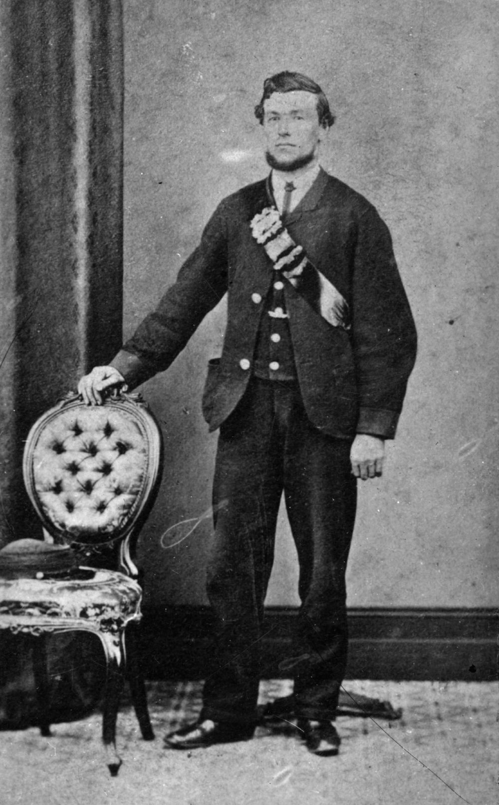

## Barnard Charles Evans CMG <small>(20‑20‑13/14)</small>

Hon Colonel Charles Evans CMG was born in Taunton, Somerset on 15 April 1845, the son of John Evans, a railway porter and his wife, Mary Ann née Acland. Charles Evans rose from humble railway porter to Commissioner for Railways in Queensland from 1911 to 1918. In 1867 he married Mary Ann Thompson who is also buried in this grave as well as two of their children. He died in Brisbane on 31 December 1920.

{ width="40%" }  

*<small>[Colonel Charles Evans](http://onesearch.slq.qld.gov.au/permalink/f/fhnkog/slq_alma21218876490002061) - State Library of Queensland </small>* 
