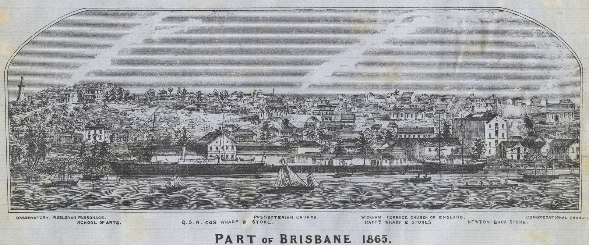
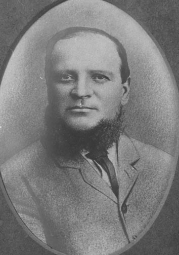

## Benjamin Harris Babbidge <small>[(1‑44‑9)](https://brisbane.discovereverafter.com/profile/31874260 "Go to Memorial Information" )</small>

[Benjamin](https://adb.anu.edu.au/biography/babbidge-benjamin-harris-42) was born on the Isle of Wight where he became an apprentice ship's smith in White's Shipyard at Cowee at the age of 14. White's docks, with its steam sawmills and engine shops, provided work for around 500 craftsmen. After completing his apprenticeship, Benjamin and his bride Elizabeth sailed for Moreton Bay arriving in January 1857. He set up a business as a ship and general smith in Elizabeth Street near Raff's Wharf. 

{ width="98%" }  

*<small>[Part of an early panorama of the city of Brisbane 1865](https://onesearch.slq.qld.gov.au/permalink/61SLQ_INST/1dejkfd/alma99183788416902061) including Raff's Wharf — State Library of Queensland.</small>* 

By 1880 he had established a rolling stock workshop in Hope Street, South Brisbane. He was the first successful tenderer for the manufacture of railway goods wagons for the Queensland Government. He was mayor of Brisbane in 1885-86. Benjamin died on 19 February 1905 aged 68.

{ width="33%" }  

*<small>[Benjamin Harris Babbidge - Mayor of Brisbane, 1885](https://library-brisbane.ent.sirsidynix.net.au/client/en_AU/search/asset/19780/0) — Brisbane City Council </small>* 

<!-- broken link -->
