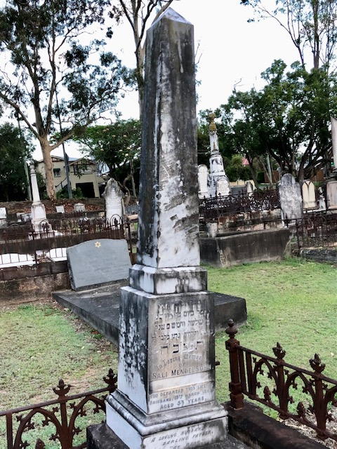

## "Sali" Mendelsohn <small>(3‑6‑7)</small>

"Sali" was his nickname. His correct name was Bezalel Saul Mendelsohn. He died in 1897 and his sons had his name inscribed as 

>Sali Mendelsohn Bezalel Saul

Sali's wife was a woman of strong opinions and she preferred his nickname to his given names, so she had them neatly chiselled off the headstone, as can be seen.

{ width="40%" }

Sali was Queensland's greatest bush balladeer and wrote many songs about the droving days, some of which are "Salt Junk" and the "New Chum's First Tour" but his most enduring ballad is "The Girls of Toowong" also variously known as "Augathella Station", "Overlanders" or "The Drover". It tells of parties of drovers who would set out from the cattle fattening yards which used to stretch from the foot of Mt Coot‑tha to the Brisbane river. They would proceed in stages to the North West, where they would collect a vast herd of beef cattle and bring them here for spelling and fattening. Another name by which this ballad was known is "Brisbane Ladies". One version of the song suggested that these ladies camped in the drovers' rough huts in which they stayed between their trips to the cattle country, and provided "home comforts", including cooking, to the travel‑weary stockmen.
