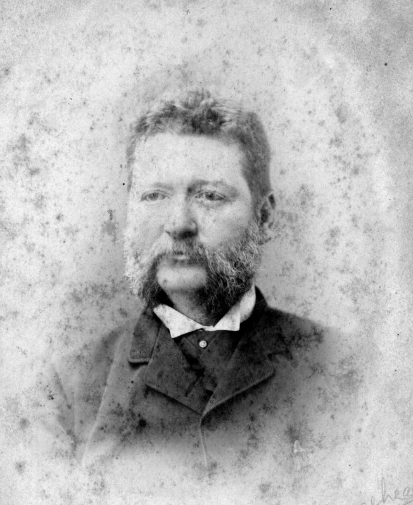

## Boyd Dunlop Morehead <small>(12‑49‑6)</small>

Boyd Dunlop Morehead was Queensland Premier from 30 November 1888 to 12 August 1890. He was born in Sydney on 24 August 1843, son of Robert Archibald Alison Morehead and his wife Helen Buchanan (née Dunlop). Morehead was MLA for the Queensland electoral district of Mitchell from September 1871 to December 1880 and represented Balonne from October 1883 to April 1896. Morehead succeeded Sir Thomas McIlwraith as Premier in November 1888. Morehead was a significant opponent of women's suffrage. He died from a cerebral haemorrhage on Monday 30 October 1905 at the age of 62 years.

{ width="40%" }  

*<small>[Boyd Dunlop Morehead](http://onesearch.slq.qld.gov.au/permalink/f/1upgmng/slq_alma21218973050002061) ca. 1890 — State Library of Queensland.</small>*
