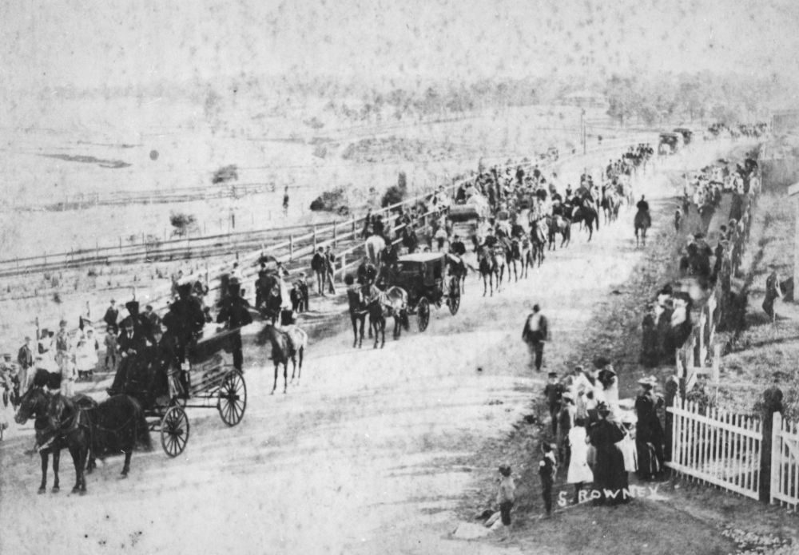

## Brickwood Colley <small>(2‑51‑2)</small>
 
"Brickie", as he was known by all, was in the second half of the 1800s as well known in Australia as any of our top jockeys today. In a period when travel to Sydney and Melbourne was measured in weeks rather than day, he rode with success in all three states. He was 47 when he died of a heart attack in the Post Office Hotel, Queens Street here in Brisbane in 1896. He had only arrived back from Sydney the previous week. He is one of only three jockeys that have had poems written about them; others being Willie Stone and Fred Archer, who is buried down south.

His funeral procession travelled from the the Brisbane General Hospital into the city, down Queen Street and along Coronation Drive, then Sylvan Road, and finally to Toowong Cemetery. Every jockey in the Brisbane area attended in full silks and colours riding a race horse. There was also a large number of carriages. The procession stretched the entire length of Queen Street. 

{ width="70%" }

*<small>[Funeral procession of the famous jockey, Brickwood Colley, in Brisbane, 1896](http://onesearch.slq.qld.gov.au/permalink/f/1upgmng/slq_alma21218250330002061) - State Library of Queensland </small>*
