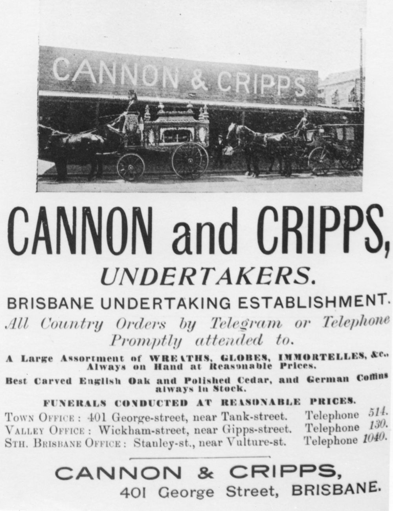

## Alfred Cannon <small>(4‑1‑21/22)</small> and Joseph Cripps <small>(4‑28‑6)</small>

Cannon and Cripps was formed in 1887 by Alfred Cannon and his brother-in-law Joseph Cripps. 

Joseph Cripps was born in Waddeson near Aylesbury, Buckinghamshire in 1849. He arrived in Queensland aboard the Ramsey in June 1873. Initially he lived in Ipswich before moving to Brisbane. After nine years in various businesses, he became an undertaker. He died after thirty one years in the profession aged 69 on 15 January 1918 after an illness of six weeks. The funeral, conducted by John Hislops and Sons, left his late residence Iona, Heussler Terrace, Milton and he was buried with the rites of the Methodist Church of which he had been a trustee for many years. He was also a prominent member of the Protestant Alliance Friendly Society of Australia and sympathised with the ideals of the Loyal Orange Lodge. Joseph Cripps had outlived his partner Alfred Cannon by three years and had gone into business with his nephew William Cannon.

Alfred Cannon died on 11 September 1915 aged 71 at his home Airlie, Edmondstone, South Brisbane. He shared the same political affiliations and lodge memberships as his brother-in- law. Alfred had married Joseph’s sister Sarah Cripps on Christmas Eve 1862 in Waddeson, the same village they had both been born and the couple joined Joseph on his voyage to Queensland.

{ width="35%" } 

*<small>[Flyer for Cannon and Cripps, Undertakers in Brisbane, Queensland, 1902](http://onesearch.slq.qld.gov.au/permalink/f/1upgmng/slq_alma21218761440002061) - State Library of Queensland. </small>*
