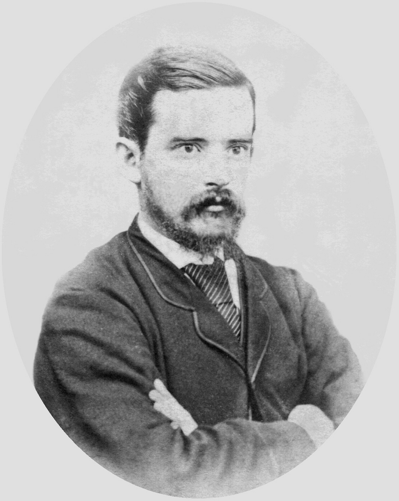

## Carl Adolf Feilberg <small>[(13‑71‑15)](https://brisbane.discovereverafter.com/profile/31849362 "Go to Memorial Information" )</small>

Carl was born in Copenhagen, Denmark on 21 August 1844. Following the early death of his parents, he was placed in foster care with Danish relatives who were living in Scotland. He received his formal education in Scotland and England finalising with a year at a college in France. Suffering from tuberculosis, he was advised to migrate to Australia, arriving in Sydney in 1867. 

His experiences gained while working on Queensland properties would influence his future work as a journalist, political commentator and author. Carl was arguably the most persistent human rights advocate and pioneer of compassion in the history of colonial Queensland. He found employment at the  *Brisbane Courier* as a political commentator and editor of *The Queenslander*. A change of proprietorship in 1880 found his views at odds with the new owners. He left to work in Melbourne, where the tuberculosis which had remained dormant returned. He returned to Brisbane as editor-in-chief of the Brisbane Newspaper Company, until his death at only 43 years of age on 25 October 1887.

<figure markdown>
  { width=40% class="full-width" }
  <figcaption markdown>[Carl Adolf Feilberg, ca. 1872](https://onesearch.slq.qld.gov.au/permalink/61SLQ_INST/dls06p/alma99183859582102061) - State Library of Queensland.</figcaption>
</figure>