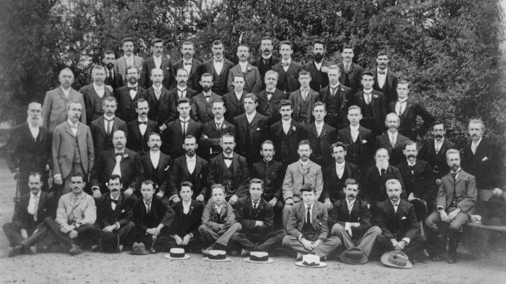

## Charles Frederick Augustus Garland <small>(15‑11‑26/27)</small>

Born in Roma Qld in 1862, Charles Garland was apprenticed a [printer's devil](https://en.wikipedia.org/wiki/Printer%27s_devil) to the proprietor of the *Western Star* and *Roma Advertiser*. He later obtained a position on the composing staff of the *Brisbane Courier* where [he served for 52 years](https://trove.nla.gov.au/newspaper/article/184073877).

*<small>[Staff working at the Brisbane Courier, ca. 1902](http://onesearch.slq.qld.gov.au/permalink/f/1upgmng/slq_alma21220275530002061) - State Library of Queensland. Cropped.</small>*
