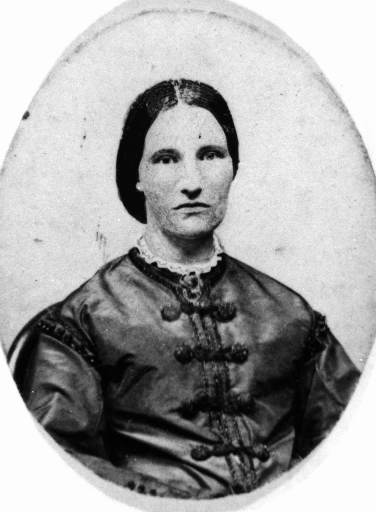

## Sir Charles Lilley <small>(12‑15‑15)</small>

Sir Charles Lilley, politician and judge was born on 27 August 1827 at Newcastle upon Tyn, son of Thomas Lilley and his wife Jane (née Shipley). He arrived in Sydney on 6 July 1856 and moved immediately to Brisbane where he was articled to Robert Little. Lilley became the first solicitor to be admitted to practice by the Supreme Court at Moreton Bay. 

In May 1860 he was elected to Queensland's first Legislative Assembly. From 25 November 1868 to 3 May 1870 he was Premier of Queensland. During a debate on electoral reform in Queensland Parliament in 1870, he put forward the idea of women's suffrage, the first to do so. His government fell the same year but he remained a staunch supporter of women's franchise until his death on 20 August 1897. 

{ width="49%" }  { width="46.35%" } 

*<small>[Sir Charles Lilley](http://onesearch.slq.qld.gov.au/permalink/f/1upgmng/slq_alma21218197120002061) on his wedding day. He married Sarah Jane Jeays in 1858. — State Library of Queensland.</small>*  
*<small>[Sarah Jane Jeays](http://onesearch.slq.qld.gov.au/permalink/f/1upgmng/slq_alma21218235890002061) — State Library of Queensland.</small>*
