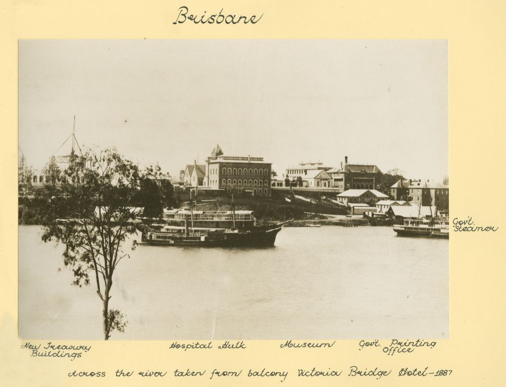

## Charles Mills <small>(1‑21‑4)</small>

Charles was the printer of the very first issue of *The Telegraph* newspaper in Brisbane on 1 October 1872 and continued in that role for 22 years. He was born on 18 August 1834 in Longford, Ireland, the son of John Mills and Dorothea née Huggins. He arrived in Sydney as a teenager and, after serving his apprenticeship, he was employed on Sir Henry Parkes' *Empire* newspaper before moving to Brisbane in 1863 to take up a position as sub-overseer on the *Queensland Daily Guardian* until 1868. After a short period of employment at the Government Printing Office, Charles started a job printing office in 1870. [He died on 23 August 1894](https://trove.nla.gov.au/newspaper/article/20719727).

{ width="70%" }

<small>[River views across to the Brisbane Museum and Government Printing Office](http://onesearch.slq.qld.gov.au/permalink/f/1upgmng/slq_alma21272136670002061), 1887 - State Library of Queensland</small>
