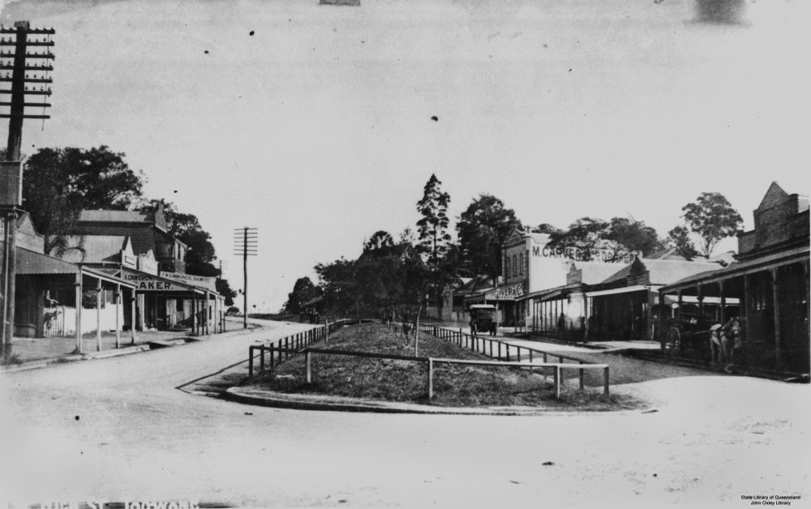

## Charles Patterson <small>(13‑30‑10)</small>

Charles Patterson was the first Mayor of the Shire of Toowong. Born in Aberdeen, Scotland, Charles arrived in Queensland in 1871. He was a member of the Toowong Council until 1925, elected Mayor numerous times in this period. He proposed the construction of the median strip in High Street, now locally known as ‘Patterson’s Folly’, as he envisaged a divided highway ultimately leading to Ipswich. His Bon Accord sawmill was one of the first industries in Toowong, opening on the site of the present Toowong Tower in 1881. The Patterson family lived at *Kinellar*, still standing on the corner of Sherwood Road and Little Maryvale Street. They were members of the Presbyterian Congregation. Charles died 4 January 1926.

{ width="70%" }

*<small>[High Street, Toowong, Brisbane, Queensland, ca. 1917](http://onesearch.slq.qld.gov.au/permalink/f/1upgmng/slq_alma21220078440002061) - State Library of Queensland </small>*
