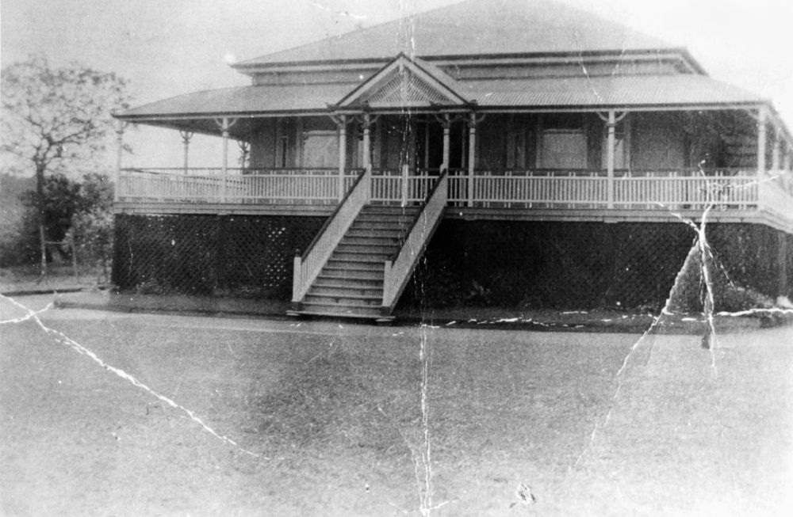

## Charles Siemon <small>(12‑21‑5)</small>

The Siemon family, which included six children, lived at *Ravensfield* on Coronation Drive and ran a dairy farm, grazing their cows on land near the Regatta Hotel until the 1930s. In 1904, the Charles bought *[Milton House](https://apps.des.qld.gov.au/heritage-register/detail/?id=600253)* which they subsequently sold to the Presbyterian Church. Charles owned extensive warehouses, factories and businesses in Brisbane and was a Toowong Town Councillor.

<!--
{ width="70%" }

*<small>[Ravensfield, home of the Siemon family, in River Road now Coronation Drive, Toowong, 1911](http://onesearch.slq.qld.gov.au/permalink/f/1upgmng/slq_alma21220239800002061) - State Library of Queensland </small>*
-->
