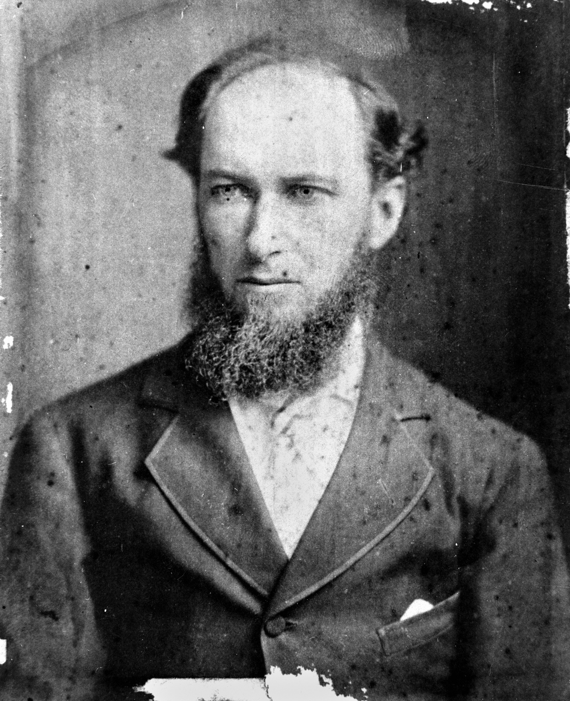

## The Honourable Charles Stuart Mein <small>[(12‑11‑13)](https://brisbane.discovereverafter.com/profile/31857173 "Go to Memorial Information" )</small>

Born in Maitland NSW on 14 June 1841 to John Stuart Mein and Mary Hall. Charles Mein was articled to Arthur Macalister in Brisbane prior to his admission as a solicitor of the Queensland Supreme Court in 1870. He was appointed to the Queensland Legislative Council in 1876, serving two periods as postmaster-general. On 17 April 1885, he was the first solicitor to be appointed a Judge of the Queensland Supreme Court, succeeding Mr Justice Pring. He died in office while visiting Sydney on 30 June 1890.

<figure markdown>
  { width=40% class="full-width" }
  <figcaption markdown>[Charles Stuart Mein](https://onesearch.slq.qld.gov.au/permalink/61SLQ_INST/dls06p/alma99183507233402061) — State Library of Queensland.</figcaption>
</figure>