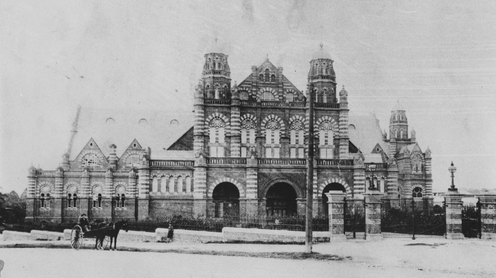

## Charles Walter de Vis <small>(16‑22‑18)</small>

Born in Birmingham England on 9 May 1829, [Charles de Vis](https://adb.anu.edu.au/biography/de-vis-charles-walter-3406) was a clergyman and then museum curator before immigrating to Queensland in 1870. He became curator of the Queensland Museum in 1882 and director of that institution in 1901 adding much to the extent of the collections, their classification and display.

*<small>[Exhibition Hall, Brisbane, ca. 1897](http://onesearch.slq.qld.gov.au/permalink/f/1upgmng/slq_alma21219199540002061). Originally built as an Exhibition Hall and Concert Hall, the building is located on the site of an earlier building which burned down in 1888. In the late 1890s the Exhibition Hall was converted to accommodate the Queensland Museum which transferred to the building in 1899. State Library of Queensland. Cropped.</small>*

<!-- https://trove.nla.gov.au/newspaper/article/190555246 -->
