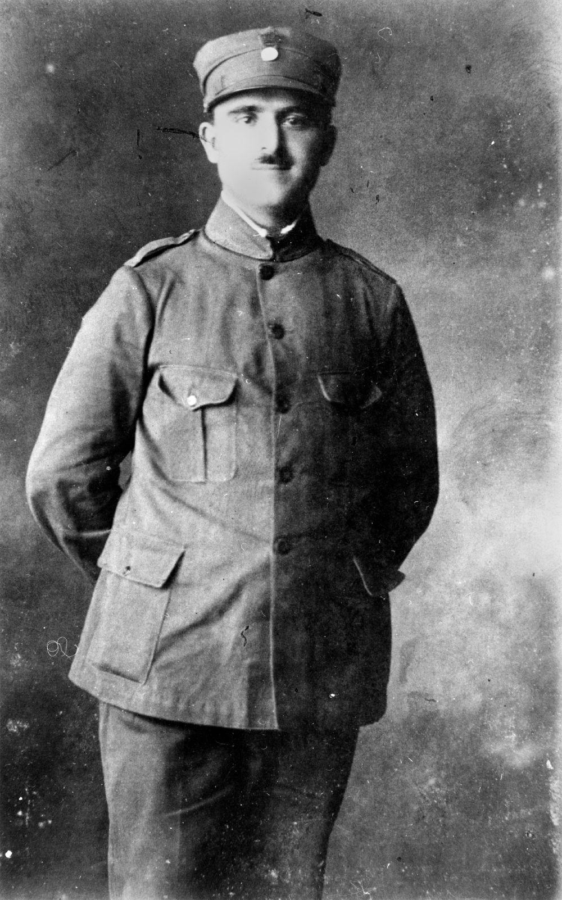

## Christy Freeleagus <small>(18‑187‑21)</small> 

<!-- 1889‑1957 -->

[Christy Kosmas Freeleagus](https://adb.anu.edu.au/biography/freeleagus-christy-kosmas-6243/text10747) was born Christos Frilingos on the island of Kythira, Greece. Inspired by stories of sailors, he moved with his older brother Peter to Sydney in 1901 before moving on to Brisbane where they established a small restaurant. Soon after they opened the Paris Café in Queen Street and the Astoria Café in Edward Street. Christy’s remaining eight brothers arrived over the next decade and in 1911 the family established Fresh Food and Ice Company Limited. Until his death, Freeleagus remained Managing Director of what became one of the state's biggest wholesale and retail food chains, providing the first employment over the years for hundreds of Greek migrants.

Freeleagus was passionate about his homeland and worked continuously to make his Greek heritage better known and respected among Australians. As a result, Freeleagus was appointed Greek Consul‑General, the first of that rank any country had appointed. 

Despite his involvement in the Greek Military and service during the Greek‑Turkish War, Freeleagus continued to urge migration to Australia, and on 22 May 1922 delivered a lecture on Australia to the Athens Literary Society, a copy of which is held in the National Library of Greece. In Australia however, his patriotism for his country never ceased and after the Italian attack on Greece during World War II, he led a number of funding appeals, leading to the highly successful Greek Day on 19 November 1941. For this work he was awarded the Silver Cross of George I. He later received the Gold Cross in 1951. Freeleagus continued this type of fundraising for his community at home in Greece throughout his life and an appeal for victims of the 1953 earthquake in western Greece raised the largest amount of money ever sent from Australia for its time.

Members of the Greek community continued to arrive in Queensland and with support and encouragement from Freeleagus began moving outside Brisbane. As a result, strong Greek communities were formed in Biloela and Home Hill during the 1920s and 1930s. A high‑ranking freemason, Freeleagus helped found the Royal Automobile Club of Queensland and became a leader of the Chamber of Commerce. 

When Freeleagus died of a heart attack on 16 May 1957, he had successfully founded the first Greek Association and his prominence in the religious and political life of the Greek community was evident through his community’s large attendance at his funeral.

{ width="30%" } 

*<small>[Christy Freeleagus, wearing the Greek army uniform, ca. 1922](http://onesearch.slq.qld.gov.au/permalink/f/1upgmng/slq_alma21220374280002061) - State Library of Queensland. </small>* 
