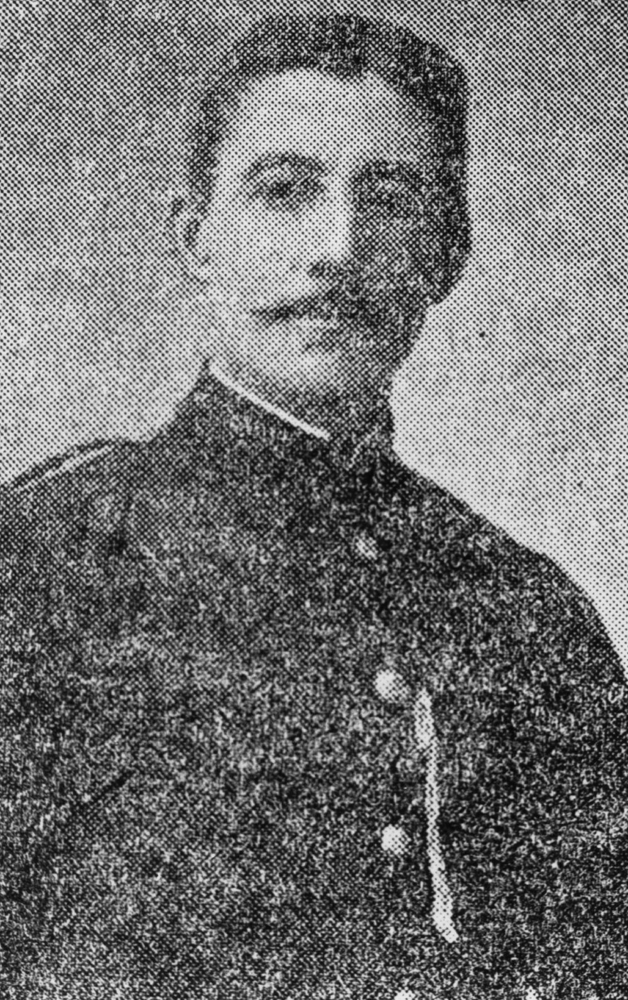

## Daniel George Bloomfield <small>(5‑101‑11)</small>

Daniel Bloomfield (1858-1915) was, for many years, a well known bandmaster and popular cornet soloist in Brisbane. His in career in music began at the age of ten as a drummer in the Royal Marines in England. He settled in Brisbane in 1883 and soon became deeply involved in the local music scene as a performer and conducting various local bands, including the Naval Brigade Band, for many years. 

{ width="40%" }  

*<small>[D. G. Bloomfield](http://onesearch.slq.qld.gov.au/permalink/f/1upgmng/slq_alma21218822040002061) — State Library of Queensland.</small>*
