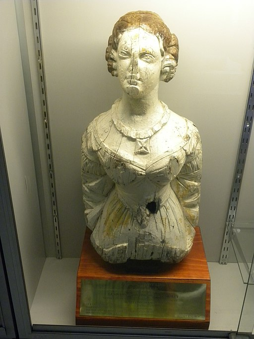

## Daniel Rowntree Somerset <small>(13‑80‑7)</small>

Daniel Rowntree Somerset (1812-1880), his wife Dora (née Higginson), and children Anna Sophia (1824-1924), Ellen Maria 1846-1898) and Henry St John (1848-1819) arrived in South Australia from Northern Ireland in 1849 but in 1850 boarded the barque *[Jenny Lind](https://en.wikipedia.org/wiki/Kenn_Reef#Jenny_Lind)* for a voyage to London via Singapore. As the ship sailed off the North Queensland coast, they were shipwrecked on Kenn Reef. Daniel later became prominent in civic affairs and was appointed Chief Clerk of Customs and Shipping Master of the Port of Brisbane.

<figure markdown>
  { width="30%" }
  <figcaption markdown>[Jenny Lind figurehead, shipwrecked 1850](https://en.wikipedia.org/wiki/Kenn_Reef#/media/File:Jenny_Lind_figurehead_carved_1847_-_shipwrecked_1850.jpg). Exhibits at Gladstone Maritime Museum, Central Queensland, Australia.</figcaption>
</figure>