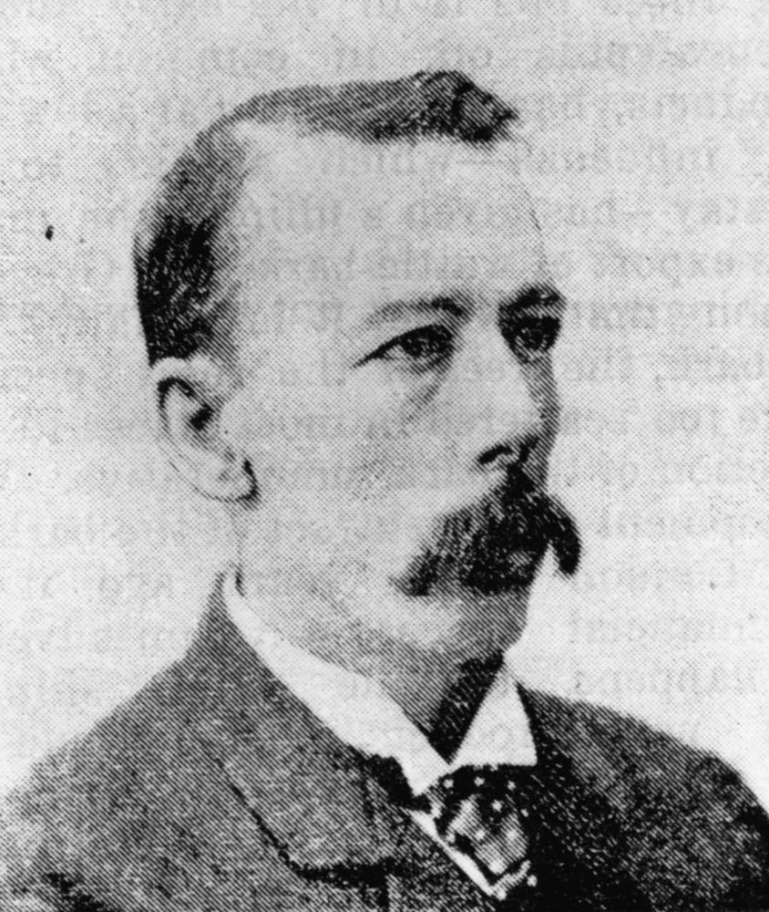
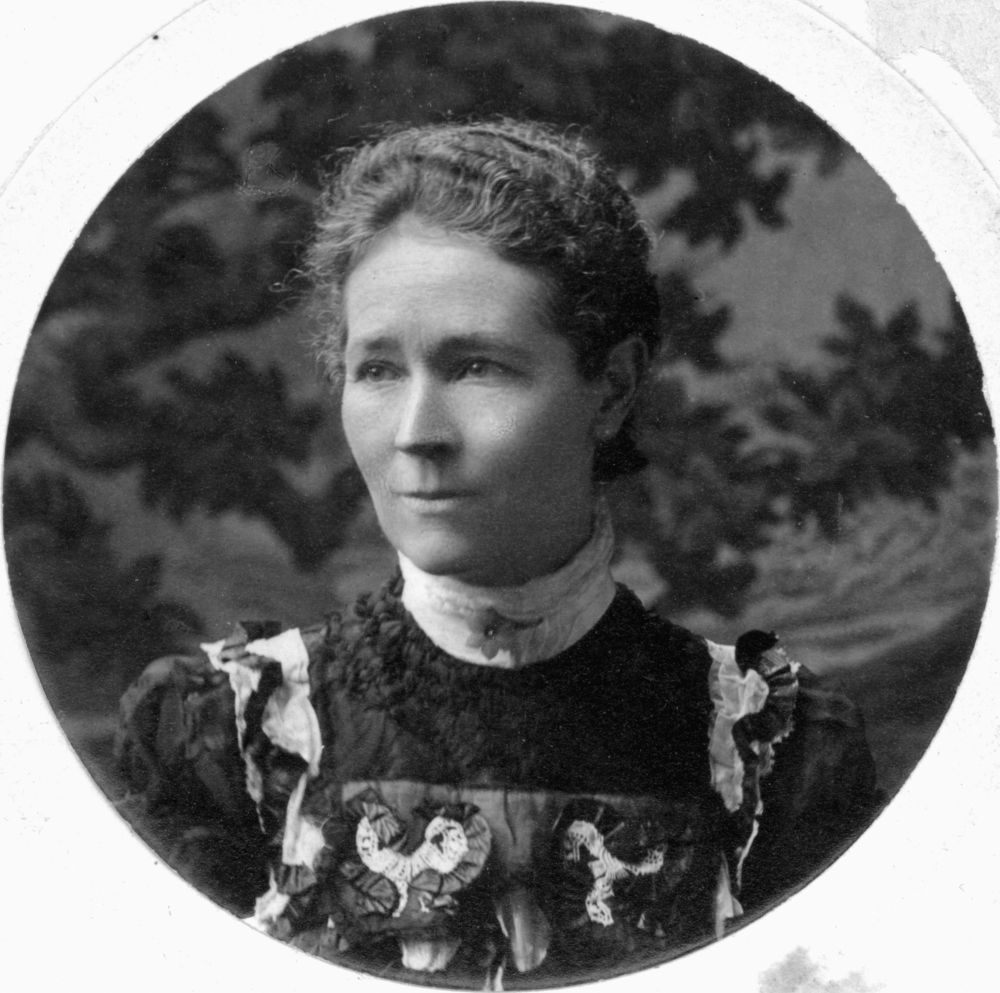

## David Hay Dalrymple <small>(12‑53‑2)</small>

David Hay Dalrymple was born on 14 December 1840 at Newbury, Berkshire, England, son of James Dalrymple and his wife Georgina (née Hay). Dalrymple reached Melbourne in 1862; He bought land in Mackay at the first sales, opened the town's first chemist shop and began pastoral investments. He was the town's first mayor in 1869-71, continuing to serve in local government until 1888 when he became a member for Mackay in the Legislative Assembly. In 1895-1903 Dalrymple served in ministries under Sir Hugh Nelson, T J Byrnes, Sir James Dickson and Sir Robert Philp, holding varied portfolios. He was one of the most strident masculinist voices in opposition to female suffrage. Dalrymple lost his seat in August 1904 and lived in retirement at Hamilton where he [died](https://trove.nla.gov.au/newspaper/article/19851385) on 1 September 1912.

{ width="33.7%" } { width="40%" }  

*<small>[David Hay Dalrymple](http://onesearch.slq.qld.gov.au/permalink/f/1upgmng/slq_digitool15986) 6 April, 1895 — State Library of Queensland.</small>*  
*<small>[Effie Dalrymple, Christmas 1900](http://onesearch.slq.qld.gov.au/permalink/f/1upgmng/slq_alma21218791890002061) Married David Hay Dalrymple at Mackay on 23 December 1880. They had four children. — State Library of Queensland.</small>*
