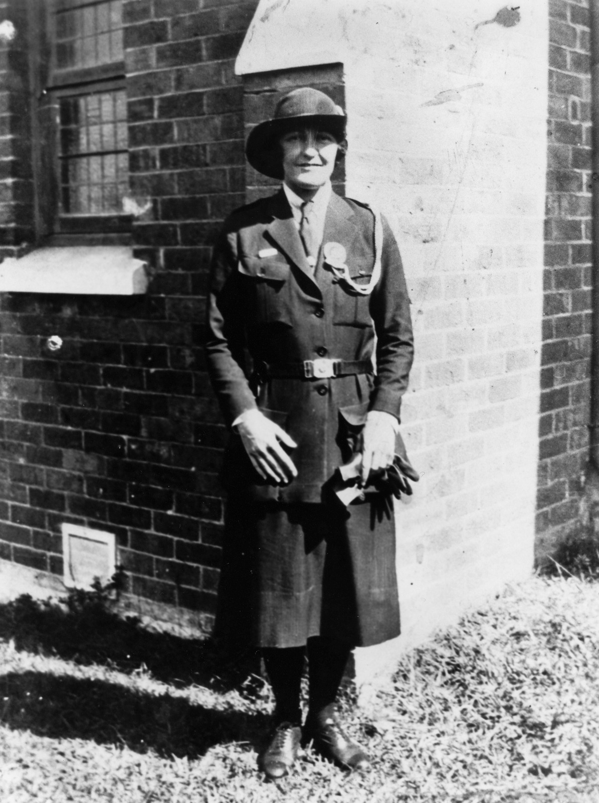

## Dorothy Hawthorn <small>[(13‑83‑1/2)](https://brisbane.discovereverafter.com/profile/31665596 "Go to Memorial Information" )</small>

Dorothy Hawthorn's many achievements and contributions to the community and well documented on her grave. Also buried here are her father, Arthur George Hawthorn, a Federal Cabinet Minister, and her grandparents, Alexander and Ann Stewart, foundation members of the St. Andrews Church, Brisbane.

Hawthorn made an outstanding contribution to the Girl Guide Association. As Deputy State Commissioner and Commissioner in Charge of Training she toured extensively throughout Queensland establinging Guide companies. In 1936 she learned how to fly at Archerfield. During World War Two, she served as a training officer in the Women's Auxiliary Air Force, based in Malvern, Victoria. After the war, Hawthorn was appointed a Commonwealth rehabilitation officer with the resposibility of assisting service women re-enter civilian life. In the 1950s, Hawthorn was the President of the Women's Section of the Queensland Country party.

<figure markdown>
  { width="40%" }
  <figcaption markdown>[Girl Guides Deputy State Commissioner, Miss D. Hawthorn, 1930](https://onesearch.slq.qld.gov.au/permalink/61SLQ_INST/dls06p/alma99183506697102061) - State Library of Queensland</figcaption>
</figure>
