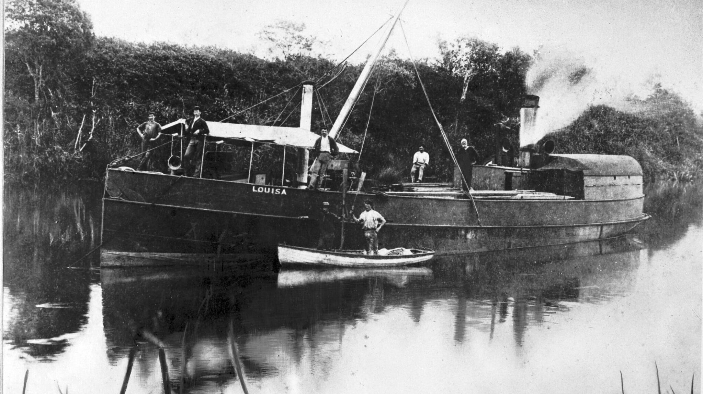

## Captain Edmund Mellor <small>(9‑38‑4)</small>

Captain Mellor, an early immigrant to Moreton Bay, arrived in the colony in January 1849 on the sailing ship *Fortitude*. In the days when the river trade was the 'lifeline' between Brisbane and Ipswich, he became owner of the river steamers *Bremer* and *Settler*. The *Louisa*, the first iron steamboat ever constructed in the colony of Queensland was built by R.R. Smellie & Co to the order of Captain Mellor. After Mellor's death on 26 September 1872 at the age of 59, the *Louisa* was used on the Logan-Brisbane run. 

*<small>[Louisa - Queensland's First Iron Steamboat](https://www.flickr.com/photos/queenslandstatearchives/30922853551) - Queensland State Archives. Cropped.</small>*
