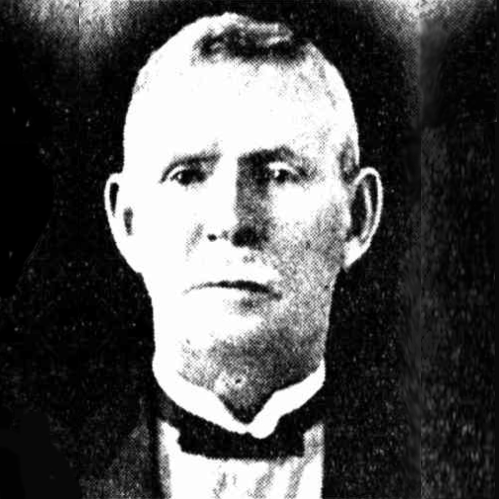
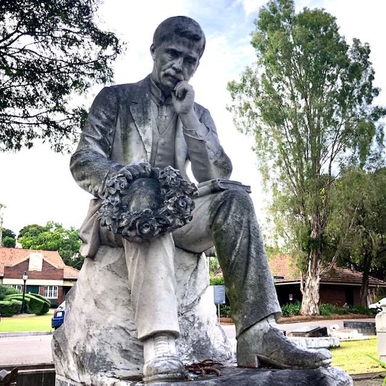
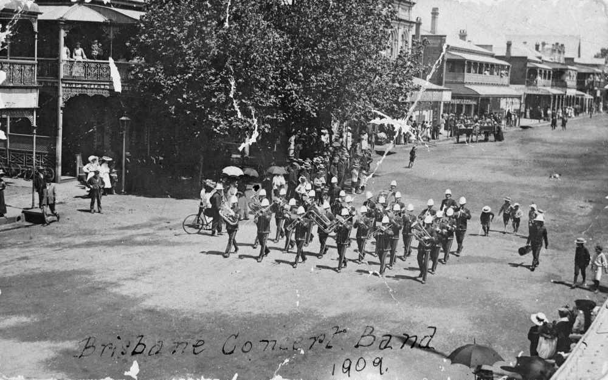

## Edward McGregor <small>[(4‑16‑17/18)](https://brisbane.discovereverafter.com/profile/31757811 "Go to Memorial Information" )</small>

Edinburgh‑born Edward McGregor worked in the Queensland Railways for twenty years before purchasing the Grosvenor Hotel. A few years later he built the Lyceum Theatre, George Street, in 1909 which he ran until [his death in 1939](https://trove.nla.gov.au/newspaper/article/184759988). McGregor spoke several languages and toured the world twice. He was a keen music lover and was patron of the Brisbane Municipal and Excelsior bands and Vice‑Patron of the Scottish and Curlew choirs.

{ width="30%" }  { width="30%" }  

*<small>[Edward McGregor](https://trove.nla.gov.au/newspaper/article/184759988) - The Telegraph, 4 Dec 1939. Edited.</small>*  

*<small>The headstone of Edward McGregor and his wife, Mary Jane, shows Edward mourning the death of his wife who died 18 years before him.</small>* 

<figure markdown>
  { width="70%" }  
  <figcaption markdown>[Brisbane Municipal Concert Band marching in Brisbane, Queensland, 1909](http://onesearch.slq.qld.gov.au/permalink/f/1upgmng/slq_alma21220219350002061) — State Library of Queensland </figcaption>
</figure>

