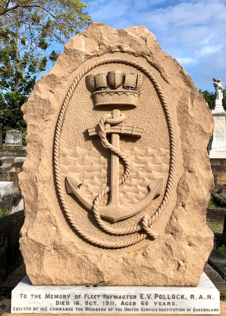

## Edward Vincent Pollock <small>(5‑62‑12)</small>

Edward Pollock was born in Ireland on 12 June 1851. He was Fleet Paymaster and Secretary to the Naval Commandant of the Commonwealth Naval Force in Brisbane. Tragically, Fleet Paymaster Pollock died on 16 October 1911 from injuries he received through falling from a tram at East Brisbane. 

The funeral was marked by the naval honours due to Fleet Paymaster Pollock's rank. A monument over his grave erected by the members of the United Services Institute was officially unveiled on Sunday 19 May 1912 in front of a large gathering of officers and men of both services as well as civilians.

{ width="40%" }  { width="40.4%" }  

*<small>[E. V. Pollock, Staff Paymaster](http://onesearch.slq.qld.gov.au/permalink/f/1upgmng/slq_alma21218736630002061) - State Library of Queensland </small>* 
