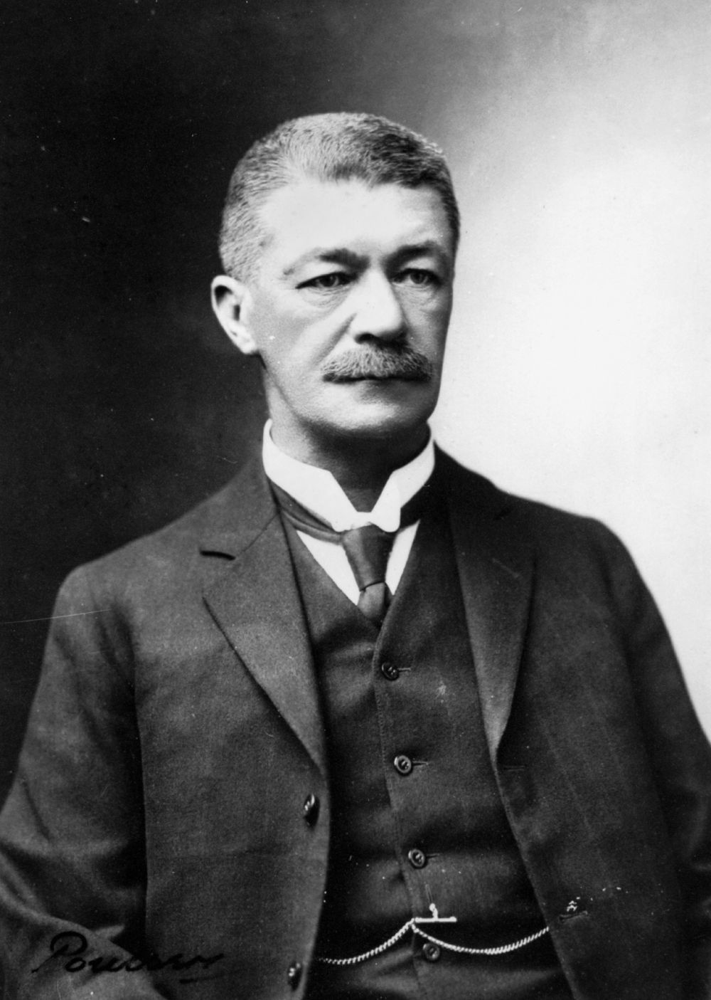

## Edwyn Mitford Lilley <small>(12‑15‑7)</small>

Brisbane-born Edwyn Mitford Lilley KC (1859-1911) was the eldest son of Sir Charles Lilley and his wife, Sarah Jane (née Jeays). He was called to the Queensland Bar in 1882. He soon acquired a large and important practice, and during his long and eminent career was engaged in many of the prominent cases heard in the Queensland courts. In 1910 he was appointed a 'King's Counsel' by the Governor. Lilley was retained by the Shearers' Union for the legal defence of unionists. He died at the age of 52 following a seizure.

{ width="40%" }

*<small>[Portrait of E.M. Lilley](http://onesearch.slq.qld.gov.au/permalink/f/1upgmng/slq_alma21251606250002061) -  State Library of Queensland</small>*
