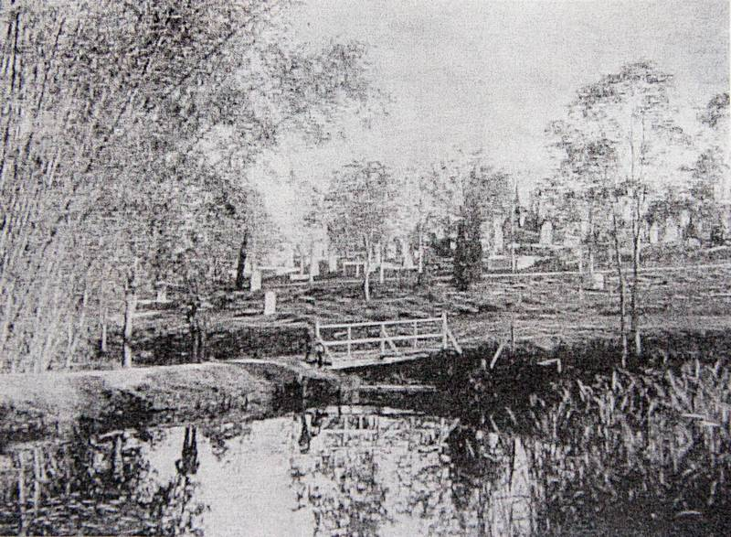
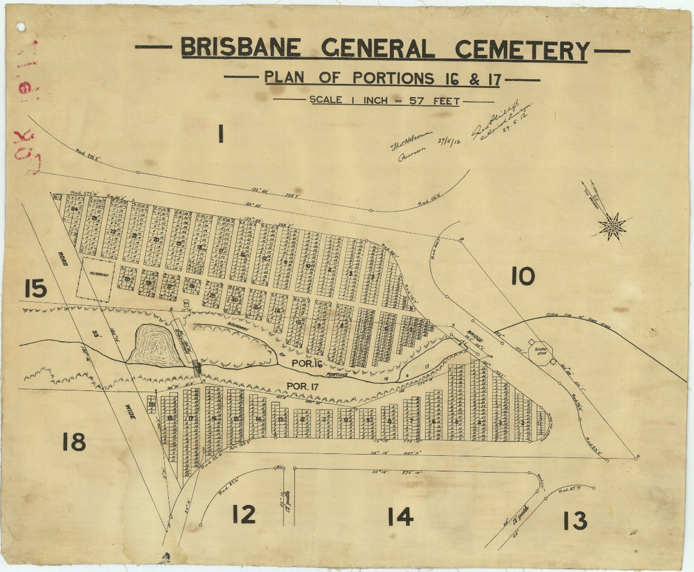

## Elizabeth Dale <small>[(1‑148‑29)](https://brisbane.discovereverafter.com/profile/31894232 "Go to Memorial Information" )</small>

Prior to 1905, the creek which runs through the Cemetery had been dammed to provide water for flowers and grapes which were grown in Portion 10 and sold to Cemetery visitors. Taps were being installed but before the dam could be emptied it claimed the life of Elizabeth Dale. 

On 31 January 1905, the day before the anniversary of her husband's death, Elizabeth left her Rosalie home with the intention of going to Wynnum for a few days. On the way, she planned to visit her husband's and brother's graves. The next day she was [found drowned](https://trove.nla.gov.au/newspaper/article/19360320) in [the Cemetery's dam](http://www.oncewasacreek.org/2014/08/up-hill-and-down-dale-where-did-elizabeth-drown/). 

{ width="50%" class="full-width" }

<small>Toowong Cemetery Dam. It no longer exists and was filled with headstones from the Paddingtion Cemetery which have been discovered in our Archaeology digs.</small>

{ width="50%" class="full-width" } 

<small>[Brisbane General Cemetery - Plan of Portions 16 & 17 showing the location of the Dam.](https://www.archivessearch.qld.gov.au/items/ITM1432148), 27 May 1912 — Queensland State Archives, Item ID ITM1432148. The road marked "ROAD 33' WIDE" on the left was not build but the road that extends to the North from it is now called "Elizabeth Dale Walk".</small>

The inquest noted that Elizabeth was in delicate health, short-sighted and prone to fainting fits. The government analyst found a [trace of morphine](https://trove.nla.gov.au/newspaper/article/19335877) in her system, which was not surprising as Elizabeth was in the habit of taking Kay's Compound, the key ingredient of which was morphine[^1]. 

[^1]: Department of Justice, *Inquest into the death of Elizabeth Dale 56/05*
