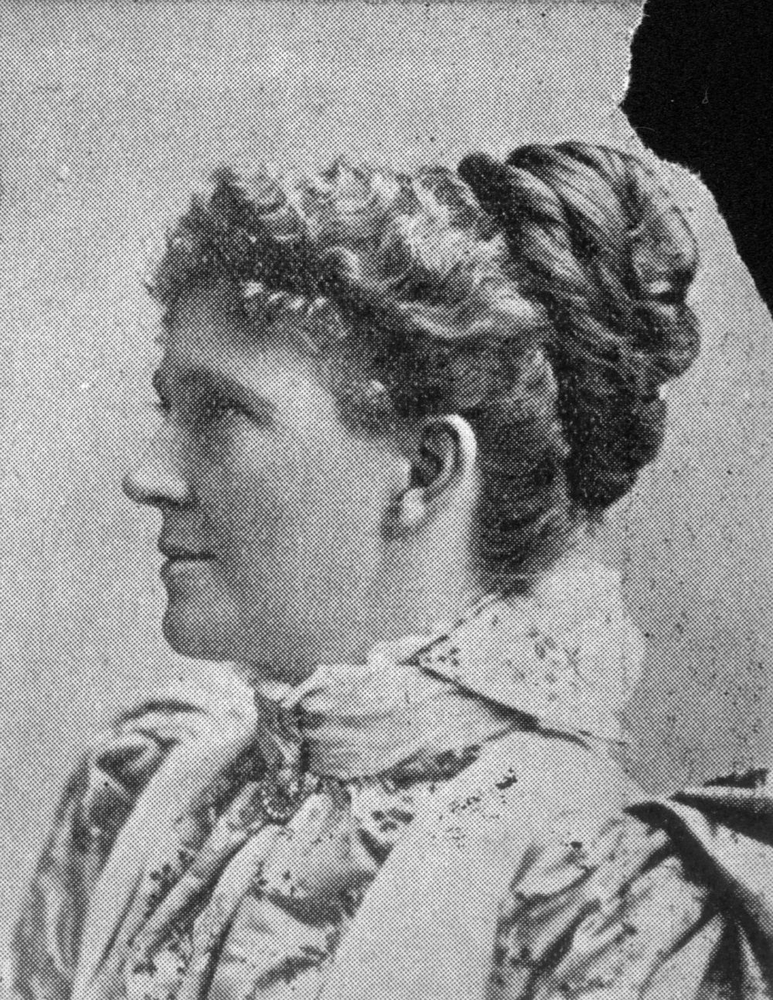

## Elizabeth Jane Kingsbury <small>(12‑42‑12/13)</small>

Mrs. John James Kingsbury was a Victorian, a daughter of Mr. David Ham. She was possessed of unusual gifts, a fine presence, a wide, clear outlook, and eloquence that gave her a great advantage in pleading the cause in which she was interested. She came by force of her gifts prominently when any movement especially concerning the welfare of women and children was involved. She had a keen sense of humour, and her speeches were characterised by humour and brilliance. She was in demand whenever a new project was started for the betterment of the State, and although her invariable answer was, *“I’m working to the pin of my collar,”* still there was always fitted in either another pin or an extra little stretch was given to the collar. 

Few women have left so clear a track successfully blazed in the history of Queensland. Mrs. Kingsbury was for years on the committee of the Sick Children’s Hospital. Then when the claims of a woman’s hospital were urged by Lady Lamington, Mrs. Kingsbury became one of the first members of the committee, relinquishing her guiding hand only when success had come to the institution. She became president of the Industrial Home for Women at Normanby Hill, and at a still later date the first president of the Queen Alexandra Home for orphans, neglected, or poor children, under the control of the Methodist Church. 

Still more presently, when war work was what mattered most in women’s lives, Mrs. Kingsbury practically illustrated the doctrine of keeping the home fires burning by strengthening existing activities and at the same time, as president of the National Council of Women, she took an active part in “Six o’clock closing,” the establishment of a bureau for the registration and classification of women for national work, the foundation of the British Australian League for the encouragement of Australian goods first, and those of the Empire next. She was elected president of the Women’s Mutual Service club, and, with her committee, brightened with kindly sympathy the many weary hours of sorrow and anxiety of soldiers’ relatives. Mrs. Kingsbury, for eight years, occupied the position of president of the National Council of Women, a federation of 44 societies, all interested in great national questions, especially in those affecting the welfare of women and children. On the occasion of the International Congress held in Rome in June, 1914, Mrs. Kingsbury represented the Queensland Council, and on her return familiarised the women of Brisbane with the representative women of other countries.^3^ Elizabeth was also an accomplished artist and wood carver. She died in 1919 aged 61.

{ width="40%" }

*<small>[Mrs J. J. Kingsbury](http://onesearch.slq.qld.gov.au/permalink/f/1upgmng/slq_alma21218947160002061) - State Library of Queensland </small>*
