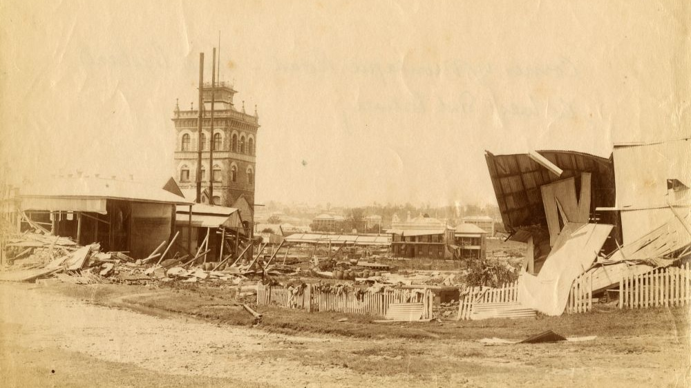

## Elizabeth Powell <small>(5‑24‑2)</small>

Elizabeth or Bessie Powell (née Turnbull) was born in England around 1870. She was the licensee of the Montague Hotel in Montague Road South Brisbane for a few months in 1897 until her death on 14 August 1897. 

{ width="100%" }

*<small>[Flood damage at the West End Brewery in Brisbane, Queensland, 1893](http://onesearch.slq.qld.gov.au/permalink/f/1upgmng/slq_alma21270209020002061). The West End Brewery was located on the corner of Montague Road and Merivale Streets, West End. The damaged Montague Hotel is in the background. - State Library of Queensland. Cropped.</small>*
