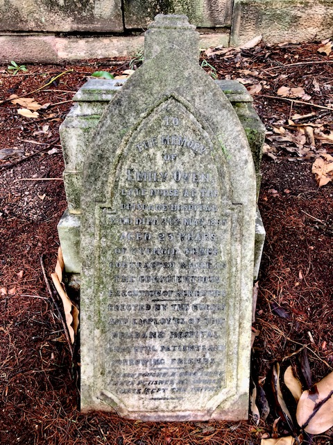

## Emily Owen <small>[(1‑39‑5)](https://brisbane.discovereverafter.com/profile/32019436 "Go to Memorial Information" )</small>

Emily Owen was an immensely popular and respected nurse at the Brisbane Hospital. She died, unmarried, aged only 23 of typhoid fever contracted doing her duties on 24 May 1885. Her headstone was [erected by the nurses and employees of the hospital](https://trove.nla.gov.au/newspaper/article/3442372?searchTerm=Emily%20owen) where she worked, grateful patients and bereaved friends

{ width="30%" }

<!--
>To the memory of  
>Emily Owen  
>Late Nurse at the Brisbane Hospital  
>Who died 24^th^ May 1885  
>Aged 23 years
>Of Typhoid Fever   
>Contracted while in   
>The Conscientious  
>Execution of her duties   
>Erected by the Nurses  
>And Employees of the   
>Brisbane Hospital  
>Grateful Patients and   
>Sorrowing Friends
-->
