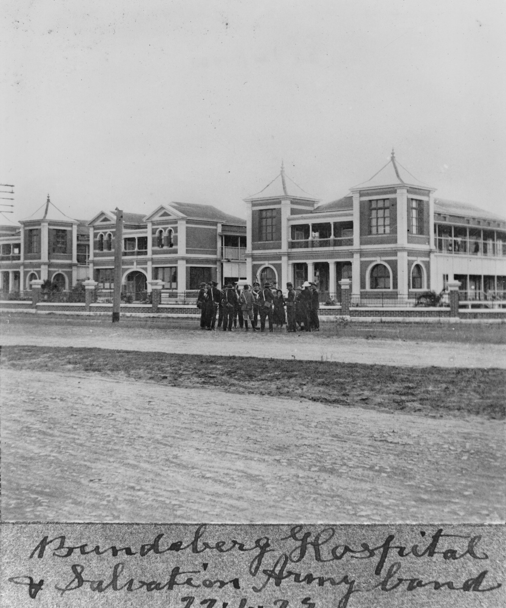

## Ethel Ivy Ellen Amess <small>[(25‑29‑16)](https://brisbane.discovereverafter.com/profile/32041084 "Go to Memorial Information" )</small>

Nurse Ivy Amess received her training at the Bundaberg General Hospital where she was extremely popular with the staff and patients. After graduation she moved to Brisbane where she contracted a fatal illness. She died aged 24 on 31 October 1927.

{ width="70%" }

*<small>[Bundaberg General Hospital, 1923](https://onesearch.slq.qld.gov.au/permalink/61SLQ_INST/1dejkfd/alma99183509388002061) — State Library of Queensland. Cropped.</small>*

<!--
>In loving memory of sister Ethel Ivy Ellen AMESS   
>died 31^st^ Oct 1927 aged 24 years.   
>At Rest
-->
