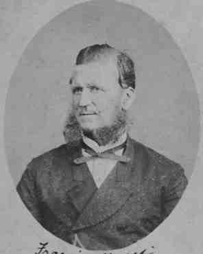

## Francis Beattie <small>[(9‑39‑7)](https://brisbane.discovereverafter.com/profile/31996036 "Go to Memorial Information" )</small>

The fire alarm bell rang just after 4.30am on 21 December 1871. [The Ann Street Presbyterian Church was ablaze](https://trove.nla.gov.au/newspaper/article/1303176). The City Volunteer Fire Brigade under Superintendent [Francis Beattie (1829-1886)](https://en.wikipedia.org/wiki/Francis_Beattie_(Queensland_politician)) attended. Beattie was appointed Deputy-Superintendent of the City Volunteer Fire Brigade in 1868 and Superintendent of the Brigade in 1870 and continued in that role with the Brisbane Fire Brigade from 1878 until he retired in 1883. After settling in Brisbane in 1862, he opened a hat and cap shop. He served as an alderman for the Fortitude Valley Ward and two terms as MLA for the Fortitude Valley electorate.

<figure markdown>
  { width="75%" class="full-width" }
  <figcaption markdown>[Alderman Francis Beattie, ca. 1870](https://library-brisbane.ent.sirsidynix.net.au/client/en_AU/BrisbaneImages/search/detailnonmodal/ent:$002f$002fSD_ASSET$002f0$002fSD_ASSET:19696/email?qu=Alderman+Francis+Beattie&rm=BRISBANEIMAGES0%7C%7C%7C1%7C%7C%7C0%7C%7C%7Ctrue&d=ent%3A%2F%2FSD_ASSET%2F0%2FSD_ASSET%3A19696%7E%7E0&te=ASSET&lm=ALL_ASSETS). — Brisbane City Council.</figcaption>
</figure>
