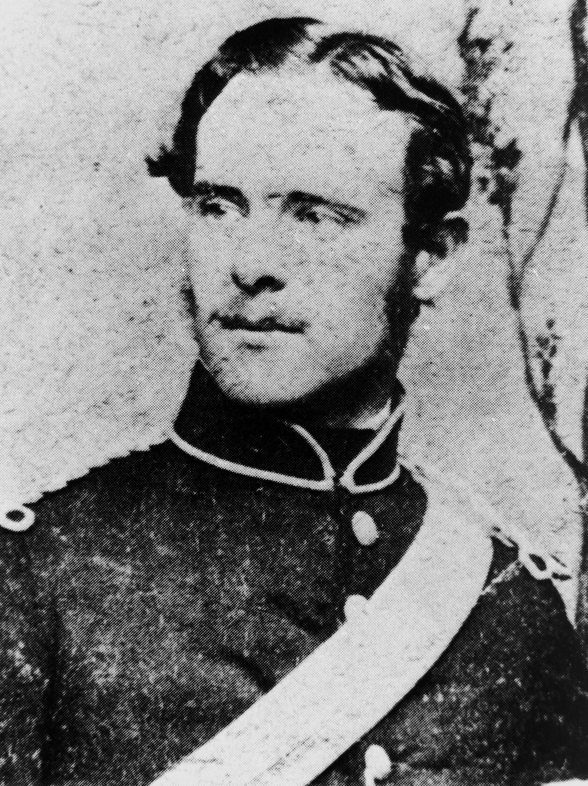

## Francis Drummond Grenville Stanley <small>(9‑32‑6)</small>

A noted colonial architect, F.D.G. Stanley designed many of Toowong’s grand houses, including *Sidney House*, demolished to make way for the ABC Studios, *Ardencraig*, which stood on Golding St and *Easton Gray* (1869) the residence of Sir Arthur Palmer. He also designed the heritage-listed [St Thomas Anglican Church](https://apps.des.qld.gov.au/heritage-register/detail/?id=600336) on High Street, Toowong.

{ width="60%" } { width="28.2%" }

*<small>[St. Thomas' Church Toowong, looking from Burns Road, Brisbane, Queensland, ca. 1917](http://onesearch.slq.qld.gov.au/permalink/f/1upgmng/slq_alma21220179080002061) - State Library of Queensland </small>*

*<small>[Portrait of Colonial Architect Francis Drummond Greville Stanley](https://onesearch.slq.qld.gov.au/permalink/61SLQ_INST/tqqf2h/alma99184003660702061) - State Library of Queensland </small>*

<!--
http://queenswharf.org/people/francis-drummond-greville-stanley/
https://www.familyhistory.bdm.qld.gov.au/details/5f236bf741400f5473125bb04b872aca79a817fe5e883c1655239373e2659677
-->