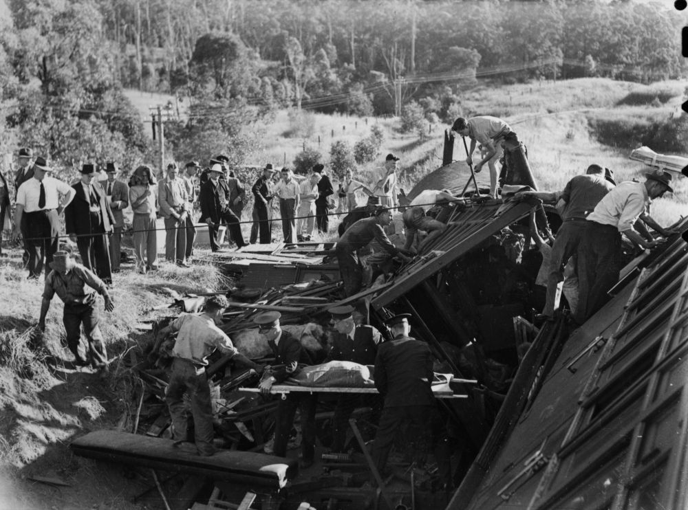

## Francis Ernest Delaney <small>(10‑83‑17)</small>

18‑year‑old Frank Delaney was born in Texas Queensland. He was a victim of one of [Queensland's worst rail disasters](https://trove.nla.gov.au/newspaper/article/56780805). He died on 5 May 1947 and was buried with his father Lance Corporal Francis Patrick Delaney who had died in 1942 from service injuries. His mother, Beatrice was also laid to rest in this grave in 1985.

{ width="47%" }  { width="47.1%" } 

*<small>[Crowd gathered at the Camp Mountain railway disaster, 1947](http://onesearch.slq.qld.gov.au/permalink/f/1upgmng/slq_alma21218120630002061) - State Library of Queensland </small>*   
*<small>[Rescue workers remove a body from a railway carriage at Camp Mountain, 1947](http://onesearch.slq.qld.gov.au/permalink/f/1upgmng/slq_alma21218105740002061). A crowd of people observe as a body is carried on a stretcher from the wreckage by rescue workers. The picnic train organised by the Customs and Excise department's social club, left Brisbane with nearly 500 women and children at 8.55 am. - State Library of Queensland </small>* 
