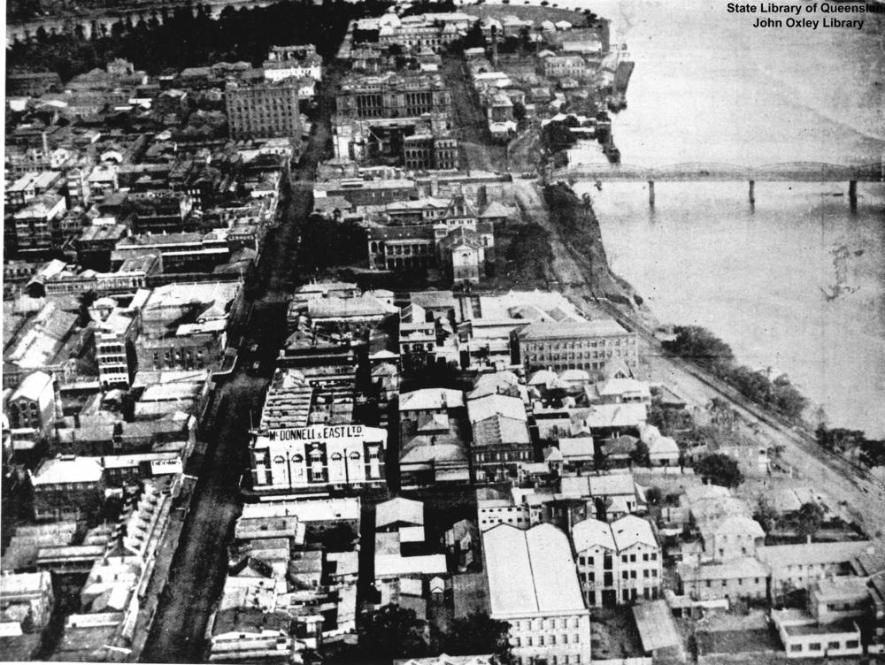
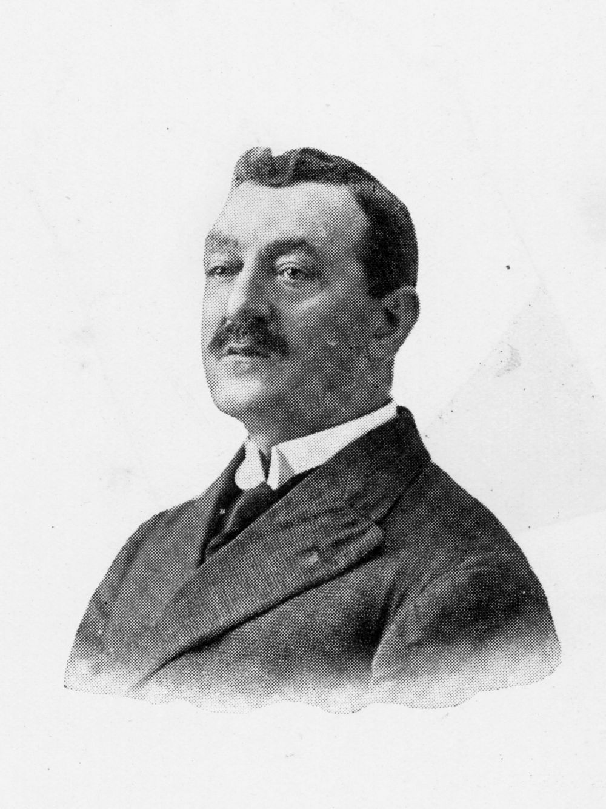

## Francis (Frank) McDonnell <small>(7A‑17‑23)</small> 

McDonnell was born in 1863 at Ennis, Co. Clare to farmer James McDonnell and Elizabeth Bradish. His father died when he was seven and he went to work in a factory before being educated by the Christian Brothers at Ennis. In 1879, he was employed by Gallagher Bros. of Ballina, Sligo; a fellow employee being T. C. Beirne. 

McDonnell arrived in Brisbane in 1886 and married Mary Heffernan in 1890. He worked as a drapery assistant for Finney Isles & Co., and then with T. J. Geoghegan, and from 1889 to 1896 for Edwards and Lamb. In 1901 he established the firm of McDonnell and East with Hubert East from Roscommon. They were backed financially by publican Peter Murphy who alternated with them as director of the company. 

In 1888 McDonnell organised the Shop Assistants Early Closing Association with his former colleague T. C. Beirne. He represented Labor for Fortitude Valley in 1896 and introduced the Early Closing Bill which was successful in 1910. He was a member of the Labor Party executive 1898—1903 and Treasurer 1901—1903. He was appointed to the Legislative Council 1907—1922 and promoted Home Rule for Ireland. In 1910 he founded and was Director of the *Hibernian* newspaper. He was the first Trustee of Trades Hall and original member of The University of Queensland Senate 1910. Frank died in 1928.

{ width="60.2%" }  { width="34%" } 

*<small>[Aerial view of George Street, Brisbane, 1923](http://onesearch.slq.qld.gov.au/permalink/f/1upgmng/slq_digitool92468), Victoria Bridge can be seen crossing the Brisbane River on the right, and McDonnell and East Ltd. is prominent towards the bottom right of George Street — State Library of Queensland.</small>*  
*<small>[Frank McDonnell](http://onesearch.slq.qld.gov.au/permalink/f/1upgmng/slq_alma21220292480002061) — State Library of Queensland.</small>*
