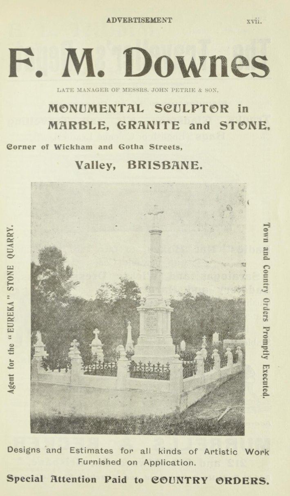
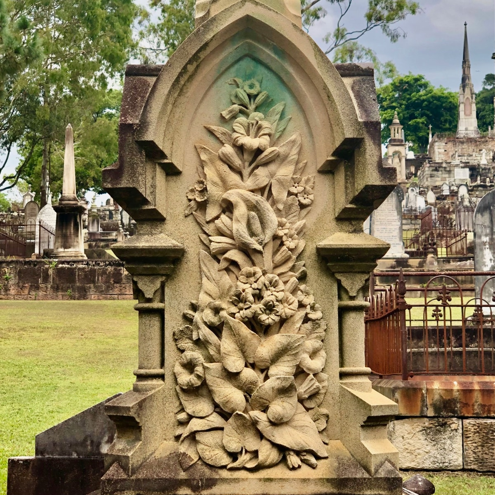

## Frank Martin Downes <small>(13‑4‑8)</small>

Frank Martin Downes was [born in 1848](https://www.familyhistory.bdm.qld.gov.au/details/8519478a9dd500f066995d5b3ed0b3e9840b9c3cc8040d7b631c767b9bf2f705) to Henry Downes and his wife ==Elizabeth== Mary Ann, née Martin. Frank was apprenticed to John Petrie’s firm where Frank's father also worked. Caroline Ness married Frank in Queensland on 28 September 1869.

Frank later became the [manager at John Petrie & Son](https://trove.nla.gov.au/newspaper/article/97526386?searchTerm=MONUMENTAL) monumental works until the firm went bankrupt in 1894. The [F.M. Downes](https://trove.nla.gov.au/newspaper/article/70863391?searchTerm=DOWNES) monumental works started business in April 1894 in Wickham and Gotha Streets, Fortitude Valley.

<figure markdown>
  { width="40%" }
  <figcaption markdown>[F.M. Downes Advertisement in Pugh's Queensland almanac and directory, 1901](https://nla.gov.au/nla.obj-3029986054/view?sectionId=nla.obj-3036927085&searchTerm=monumental+mason&partId=nla.obj-3030027520#page/n22/mode/1up).</figcaption>
</figure>

One of the most beautifully carved monuments in Toowong Cemetery is that of [Frederick Ness](https://trove.nla.gov.au/newspaper/article/3488832?searchTerm=ness%20downes), the brother-in-law of F.M. Downes.

<figure markdown>
  { width="40%" }
  <figcaption markdown>Frederick Ness headstone (13-4-8)</figcaption>
</figure>

<!--
Frank was the [Brisbane District, Provincial Grand Master](https://trove.nla.gov.au/newspaper/article/172140710?searchTerm=M.U.I.O.O.F.) of the Manchester Unity Independent Order of Odd Fellows in 1896, when the Friendly Society explored the formation of Female Lodges.
-->

On 26 August 1918, Frank was severly injuried in an accident at his monumental works when a crane jib broke and struck him, crushing his right knee, fracturing his left leg, and injuring his right ribs. [Frank died in the General Hospital early that evening](https://trove.nla.gov.au/newspaper/article/174824552?searchTerm=monumental%20mason).

<!--
??? warning "Research"

    - [126 Annie Street, New Farm](https://www.realestate.com.au/news/piece-of-brisbane-history-with-family-ties-to-channel-9-newsreader-melissa-downes-is-for-sale/) The rare piece of Brisbane’s history was built circa 1865 by a father and son team of stonemasons from Essex, England. Featured in [Homes with History on the New Farm Peninsula](https://newfarmhistorical.org.au/new-book-homes-with-history-on-the-new-farm-peninsula/)
    - Was Frank born overseas? 
    - https://trove.nla.gov.au/newspaper/article/187790680?searchTerm=Frederick%20Ness 
    - [Wyandotte eggs, Clayfield](https://trove.nla.gov.au/newspaper/article/175310957?searchTerm=%22F.%20M.%20DOWNES%22)
    - [WANTED strong, willing Youth. F. M. Downes, Monumental Works, Wickham street. 3 August 1899](https://trove.nla.gov.au/newspaper/article/175312839?searchTerm=%22F.%20M.%20DOWNES%22)
    - [Prov. Grand Master, Female Lodge](https://trove.nla.gov.au/newspaper/article/172140710?searchTerm=%22F.%20M.%20DOWNES%22) - 4 November 1896
    - [M.U.I.O.O.F. Installation of District Officers, Presentation of Jewel and Regalia of office to Bro. F. M. Downes](https://trove.nla.gov.au/newspaper/article/172149901?searchTerm=%22F.%20M.%20DOWNES%22) - 1 March 1897
    - [Ad, 15/9/1900](https://trove.nla.gov.au/newspaper/article/162120457?searchTerm=%22F.%20M.%20DOWNES%22)
    - [ad 1901 with photo. LATE MANAGER OF MESSRS. JOHN PETRIE & SON](https://nla.gov.au/nla.obj-3029986054/view?sectionId=nla.obj-3036927085&searchTerm=monumental+mason&partId=nla.obj-3030027520#page/n22/mode/1up)
-->
