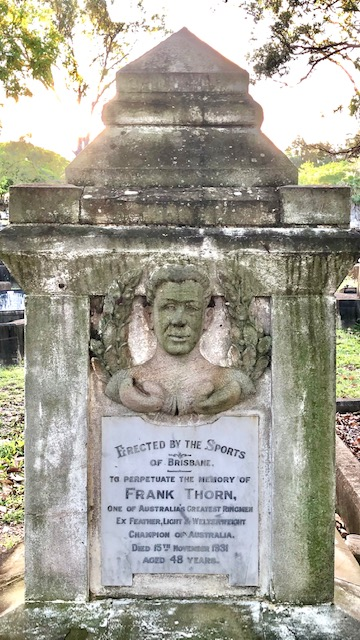

## Frank Thorne <small>(21‑20‑16)</small>

Born at Gawler South Australia in 1883. He apprenticed as a Jockey, weighing at that time 6st 9lb. As a recreation Thorn used to indulge in sparring, and later learnt the leads and stops from ex-heavyweight champion Bill Doherty, and from the famous Prank Dooley. Subsequently Thorn drifted to [Kalgoorlie](https://trove.nla.gov.au/newspaper/article/95278367), where he took to the boxing profession. His first contest was a bare knuckle, fight-to-a-finish affair with Alf. M'Coy in 1898, which he won in 32 rounds. He then had a remarkable run of success, winning some 35 bouts, including 25 through the agency of a knock-out, until he lost on points to Tom Dunn at Kalgoorlie. 

By 1905 Thorn was right in the front rank, and between then and 1909 won three Australian championships, feather, light, and welter. Among the men he defeated were such knights of the padded glove as Bob Greenshields, Hughie Mchegan, Charlie Frost, Charlie Griffin, Hock Keys, Sid Sullivan. Kid M'Coy. Bob Turner. Dick Cullen, Arthur Douglas, and Budholf Unholz (welterweight champion).

In 1912 Thorn came to Brisbane. He took part in many contests at the Brisbane Stadium, defeating among others, Joe Russell, George Taylor, Alf Morey, Marcel Denis, Joe Brooks, Jimmy Hill, Jack Clune, Wave Oelkle, Jack Humphries, Jerry Sullivan, and Jack  Finney. After several years' retirement from the ring he attempted a "come-back" at the Stadium but was stopped by Herb Ackworth. 

Thorn's career was remarkable by the fact that, although only a featherweight, besides fighting In his own class, he fought the leading light-weights and welters, earning the title of "The Grand Old Man of the Ring". Thorn had conducted a physical culture and boxing academy in Brisbane for some years, teaching personally.

{ width="40%" }

<!-- Suicide https://trove.nla.gov.au/newspaper/article/54702384?searchTerm=%22Frank%20Thorne%22 -->
