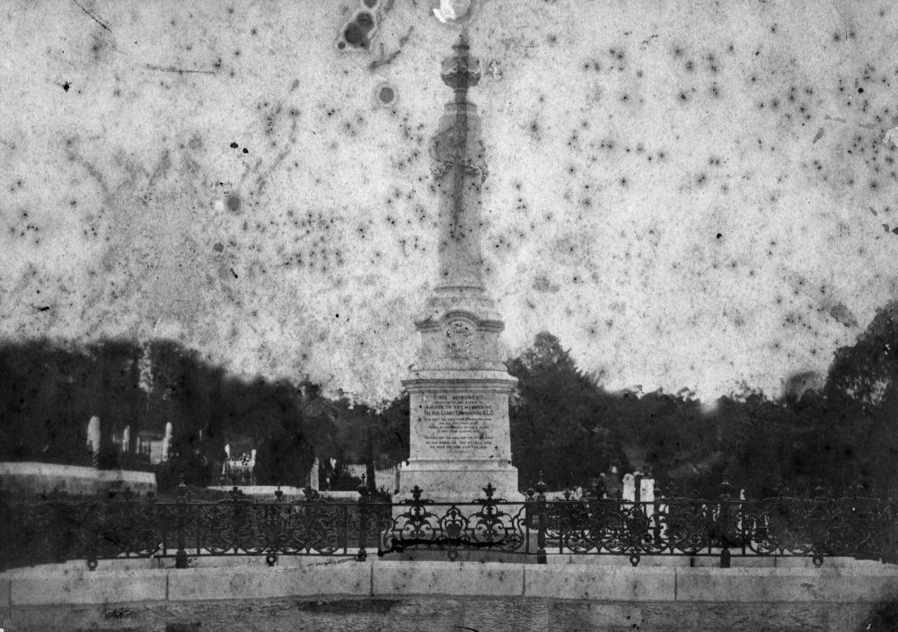
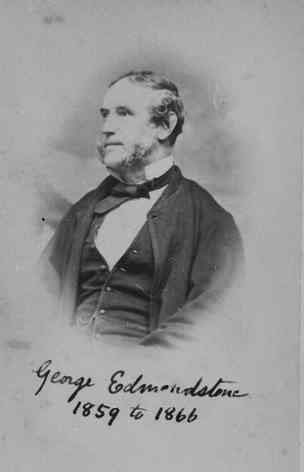

## George Edmondstone <small>(13‑20‑5)</small>

[George Edmondstone](https://adb.anu.edu.au/biography/edmondstone-george-3469) was born in Edinburgh, Scotland, on 4 May 1809 son of William Edmondstone and Alexandrina Farquhar. In 1832, he arrived in New South Wales and had businesses in Sydney and Maitland. On 10 July 1837 in Sydney he married Alexis Watson Tilleray. In 1840 he purchased Normanby Plains Station in Queensland. He sold this in 1842 and was one of the early free settlers in Brisbane, working as a butcher. He was an Alderman in Brisbane 1859—66 and the Mayor in 1863—64. In the Queensland Legislative Assembly he represented East Moreton in 1860—67, Brisbane in 1869—73 and Wickham in 1873—77. He retired from business because of a heart complaint and died at his home in Breakfast Creek on 23 February 1883.

{ width="65%" }  { width="29.425%" } 

*<small>[Monument erected to the memory of George Edmondstone](http://onesearch.slq.qld.gov.au/permalink/f/1upgmng/slq_alma21218962980002061). Died 23 February 1883. His widow Mrs Alexa Edmondstone, who died in Brisbane in 1887, is also buried there. — State Library of Queensland.</small>*   
*<small>[Alderman George Edmonstone](https://library-brisbane.ent.sirsidynix.net.au/client/en_AU/BrisbaneImages/search/results?qu=Alderman+George+Edmonstone&rm=BRISBANEIMAGES0%7C%7C%7C1%7C%7C%7C0%7C%7C%7Ctrue&te=ASSET&lm=ALL_ASSETS) — Brisbane City Council.</small>*
