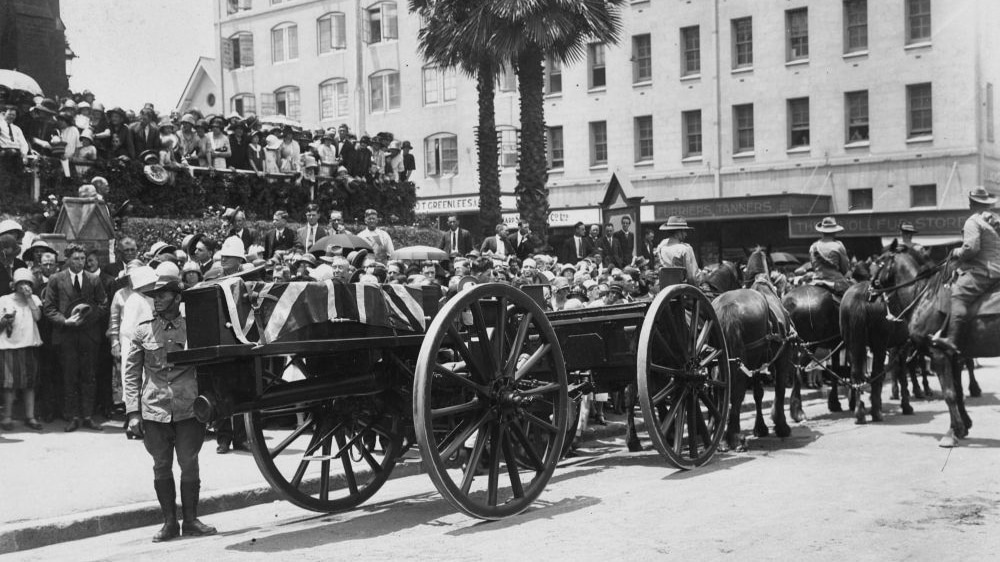

## Rev Dr George Edwards Rowe <small>(10‑48‑4)</small>

[George Edwards Rowe](https://vwma.org.au/explore/people/310401) was born in Redruth, Cornwall on 26 August 1858. He trained for the ministry in the Wesleyan Theological College at Richmond in southwest London. He arrived in South Australia in 1881 where he won great popularity as a pastor and preacher and was an advocate for social and economic reform. He was appointed to the position of Superintendent of Wesley Church in Perth in the early 1890's, a position which carried with it chairmanship of the whole colony of W.A. 

In 1906 Rev George Rowe was transferred to Brisbane where he was instrumental in implementing social service programs and promoting the work of the Central Methodist Mission (now the Wesley Mission) based at the Albert Street Methodist Church. In Western Australia and in Queensland George Rowe was responsible for instituting the order of the Sisters of the People, to give help and relief to countless numbers of poor, starving and destitute people. 

After Dr Rowe's sudden death on 27 October 1926, a marble tablet was erected by his family in the Albert Street Methodist (now Uniting) Church in his memory.

{ width="70%" } 

*<small>[Funeral procession of Rev. G. E. Rowe, Brisbane, 1926](http://onesearch.slq.qld.gov.au/permalink/f/1upgmng/slq_alma21218456030002061) - State Library of Queensland </small>*
