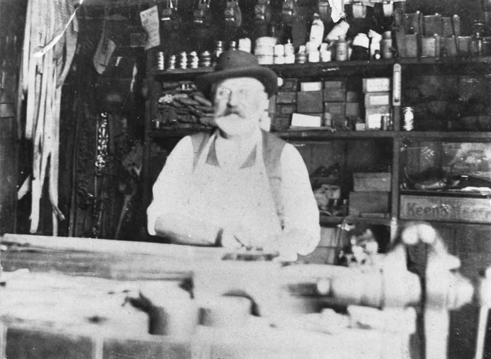
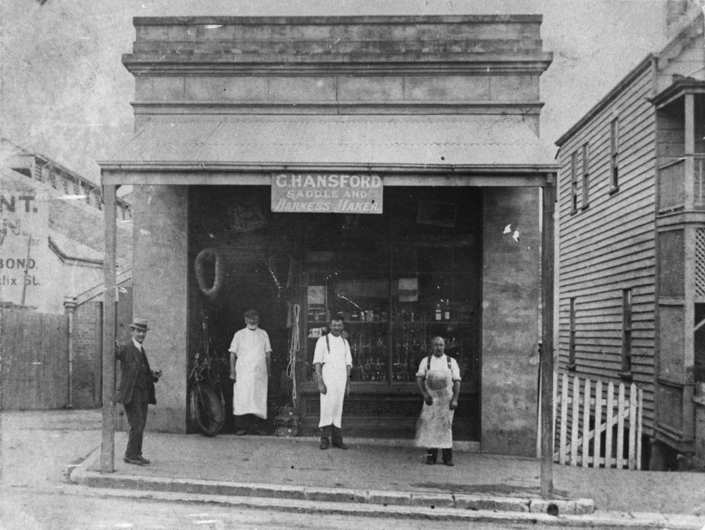

## George Hansford <small>(10‑17‑30/31)</small>

George was born on Christmas Day 1840 at St Helier, Jersey to John Hansford and Julia (née Goillon). He was baptised on 10 January 1841. Jane Blackmore Hue married George in St Saviours, Jersey on 18 August 1864. 

George and his extended family, boarded the *Gauntlet*, which sailed from London on 4 October 1874, arriving in Maryborough on January 01 1875.

In April 1887 Hansford's Saddler was located at the corner of George and Ann Streets. By July 1889 he's listed as being in Roma Street and then the business is listed as next to the Market Gate, Ann Street from November 1910. George also operated a boarding-house in Ann Street.

The saddlery business continued through his son, Reginald, in Makerston Street. 

George died on Tuesday 13 October 1925 at the residence of his daughter, Mrs Harrison, Cribb Street, Milton. Three sons, two daughters, 30 grandchildren and eight great-grandchildren survived George. George was buried with his wife, who pre‑deceased him by seven years.

{ width="43.2%" }  { width="42%" }

*<small>[George Hansford, ca. 1900](http://onesearch.slq.qld.gov.au/permalink/f/1upgmng/slq_alma21220000480002061) standing in his saddlery shop at 34 Roma Street, Brisbane - State Library of Queensland</small>*  
*<small>[Hansford Saddlers on Roma Street in Brisbane, Queensland. ca. 1900](http://onesearch.slq.qld.gov.au/permalink/f/1upgmng/slq_alma21220529050002061) - State Library of Queensland</small>*
