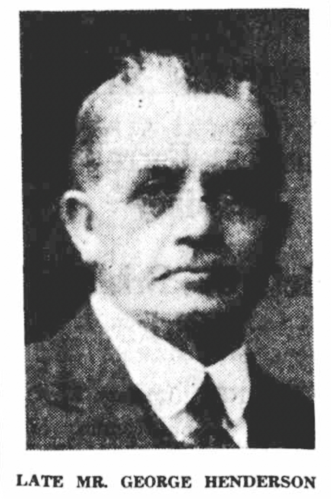
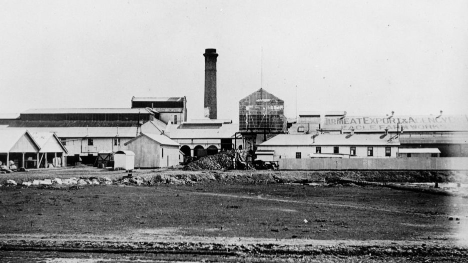

## George Henderson <small>[(8‑13‑26)](https://brisbane.discovereverafter.com/profile/31732032 "Go to Memorial Information" )</small> 

<!-- 1859‑1936 -->

Through his contact with relatives of the famed Doctor Livingstone, George Henderson developed an interest in Africa. After meeting with the Rebel Chief Cetewayo Zulu, he managed to influence railway construction there. Returning to the United Kingdom, then moving to Queensland, Henderson became heavily involved in Brisbane’s development. Initially he worked to develop and construct storm water drainage in South Brisbane and Kangaroo Point, was responsible for ploughing and paving with wooden blocks both George and Queen streets, and contributed to the construction of railway lines between Cleveland, Charleville, Cloncurry, Chillagoe, parts of the north coastline, and Eagle Farm Meatworks.

{ width="30%"  class="full-width" }

*<small>[George Henderson](http://nla.gov.au/nla.news-article184507153) - The Telegraph, 27 January 1936.</small>*

<!-- 

*<small>[Queensland Meat Export and Agency Company at Eagle Farm, Brisbane, ca. 1900](http://onesearch.slq.qld.gov.au/permalink/f/1upgmng/slq_alma21220166330002061) - State Library of Queensland. </small>*
-->