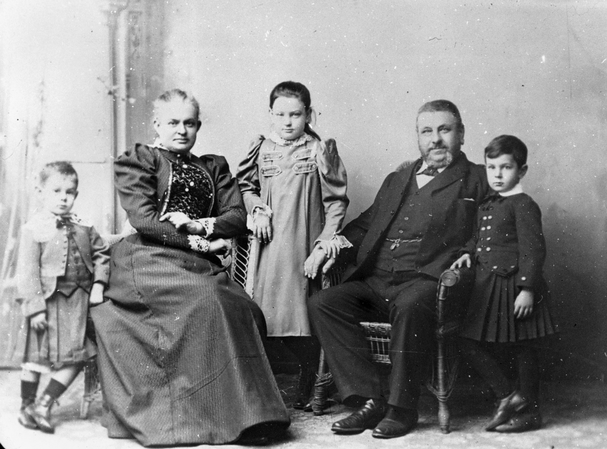
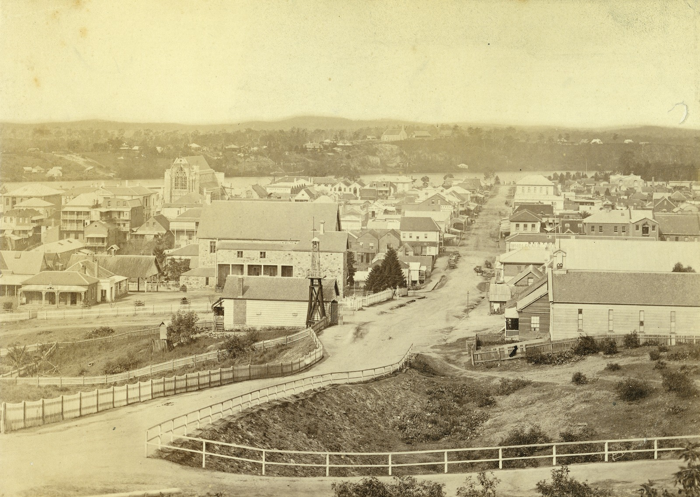

## George Prentice <small>(9‑41‑4)</small>

George Prentice Jnr was born on 8 February 1841 in Durham England where his father George Snr was a stonemason. In 1854 the family migrated to Victoria, settling in Geelong where they lived for some time before moving to Brisbane. George Jnr operated a sports and tobacconist store in Edward Street in 1877. His father who was in business as a stonemason in Roma Street and a teenage daughter of George drowned in the sinking of the *S.S. Quetta* in Torres Strait in 1890. [George died at Sandgate](https://trove.nla.gov.au/newspaper/article/183135149) on 20 February 1902 after a seizure.

<figure markdown>
  { width="70%"  class="full-width" }
  <figcaption markdown>[George Prentice and family](https://onesearch.slq.qld.gov.au/permalink/61SLQ_INST/dls06p/alma99183507617902061) — State Library of Queensland.</figcaption>
</figure>

<figure markdown>
  { width="70%"  class="full-width" }
  <figcaption markdown>[View of Edward Street looking towards the Brisbane River, 1877](https://onesearch.slq.qld.gov.au/permalink/61SLQ_INST/tqqf2h/alma99183880428502061) — State Library of Queensland.</figcaption>
</figure>

<!-- 
https://trove.nla.gov.au/newspaper/article/19148060  
https://onesearch.slq.qld.gov.au/permalink/61SLQ_INST/tqqf2h/alma99183513698202061 old
https://onesearch.slq.qld.gov.au/permalink/61SLQ_INST/tqqf2h/alma99183906327202061
 edward street
-->
